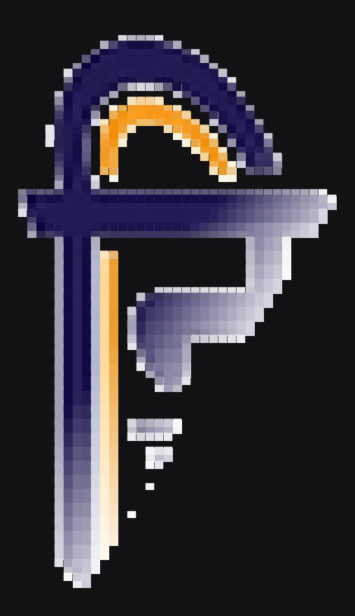
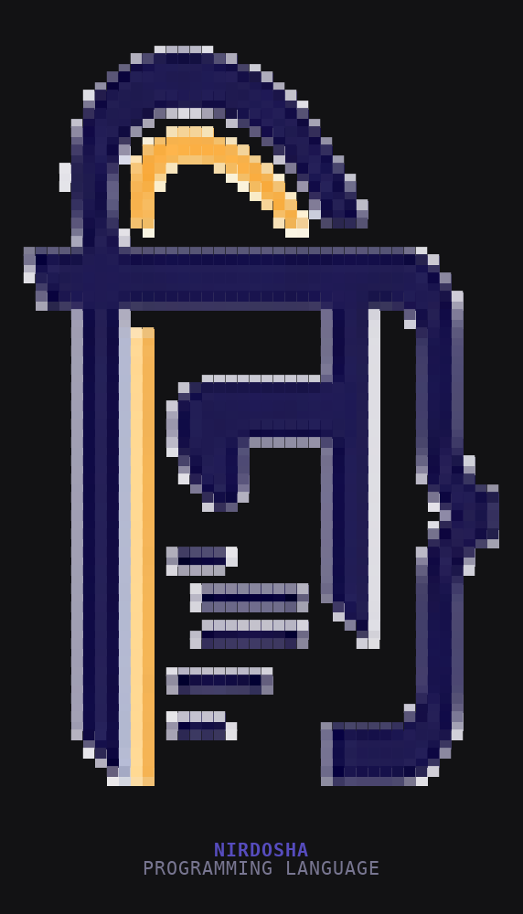

# nirdosha-tui-logo-splash

An animated nirdosha logo for terminal apps, built as a `ratatui` widget.
Three phases, driven by a single elapsed-time value (no internal
timers/threads, so it drops into any render loop as-is):

1. **Reveal** (~0.95s) -- the glyph strokes wipe in on a diagonal
   (top-left -> bottom-right), with a brief bright "catching the light"
   flash riding just ahead of the reveal edge.
2. **Type** -- `NIRDOSHA` types in letter by letter beneath the glyph,
   each letter flashing white-hot for an instant before settling into
   brand indigo/navy; `PROGRAMMING LANGUAGE` fades up after.
3. **Idle** -- everything holds still except the orange accent arc,
   which breathes forever (slow sine pulse on brightness) -- a quiet
   "alive" glow rather than a static image.

|                 mid-reveal                  |                  settled + idle                  |
| :-------------------------------------------: | :-----------------------------------------------: |
|  |  |

## Try it

This crate is its own Cargo workspace (see the `[workspace]` note at
the top of `Cargo.toml`) rather than a member of the root nirdosha
workspace -- it's a reference crate meant to be copied out into another
app, not built as part of the compiler/runtime, and standing alone
means it never has to share a lockfile resolve with everything else
here.

```sh
cd crates/tui-logo-splash
cargo run --release
```

Press any key to quit. It runs the intro once, then idles (breathing
accent) until you exit.

## How the logo becomes pixel art

There's no raster-image protocol assumed here (no sixel/kitty graphics
-- most terminals and most TUI frameworks don't support one portably),
so the icon glyph from `assets/brand/nirdosha-logo.png` is pre-sampled
down to a 44x44 character grid of true-color half-block cells (`▀`,
foreground = top pixel, background = bottom pixel -- two vertical
samples per character row, which roughly cancels a terminal cell's
~1:2 width:height aspect ratio and gives near-square effective
pixels). That grid is baked into `src/logo_pixels.rs` as a plain Rust
const array -- no image-decoding dependency at runtime.

The baked-in "NIRDOSHA" / "PROGRAMMING LANGUAGE" wordmark at the bottom
of the source PNG is deliberately cropped out of the sample and instead
drawn as real styled terminal text in `logo_anim.rs` -- text renders far
crisper than raster pixel-art text ever could at this resolution.

Regenerate `src/logo_pixels.rs` (e.g. after the source PNG changes, or
to try a different resolution) with:

```sh
python3 gen_logo_pixels.py   # needs Pillow: pip install pillow
```

## Using this in another TUI app

The entire integration surface is two files and one call:

1. Copy `src/logo_anim.rs` and `src/logo_pixels.rs` into your app
   (adjust the `mod`/`use` paths to fit).
2. From your draw function, call:

   ```rust
   let elapsed = Instant::now().duration_since(app_start).as_secs_f32();
   logo_anim::render(frame.buffer_mut(), area, elapsed);
   ```

`render` centers the logo + wordmark within `area` and is pure
(reads `LOGO`/`elapsed`, writes into `buf`) -- it owns no state and
spawns nothing, so it composes fine alongside the rest of your UI.

`src/main.rs` in this crate is just this demo's own terminal
setup/event loop (`crossterm` raw mode + alternate screen, ~60fps
poll loop, exit on any keypress) -- not part of the integration
surface above.

### Tuning

The timing/color constants live at the top of `logo_anim.rs`:

| Constant | Controls |
| --- | --- |
| `REVEAL_SECS` | How long the diagonal wipe-in takes |
| `SHIMMER_TRAIL` | Length of the bright flash riding the reveal edge |
| `TYPE_PER_CHAR` | Delay between each letter of `NIRDOSHA` typing in |
| `TYPE_FLASH` | How long each letter flashes white before settling |
| `WORD_TO_SUB_GAP` / `SUB_FADE_SECS` | Pause before, and fade-in speed of, the subtitle |
| `IDLE_PERIOD` / `IDLE_BOOST` | Speed and intensity of the idle accent breathe |
| `WORD_FG` / `SUB_FG` | Wordmark / subtitle colors |
