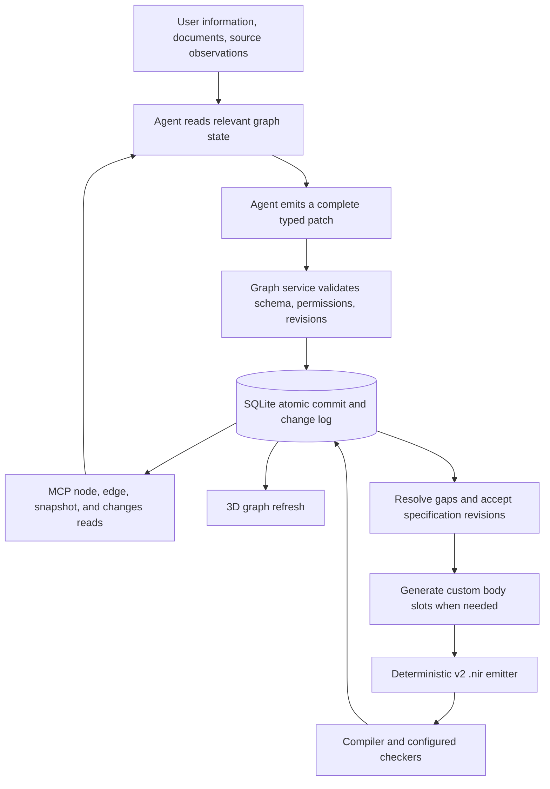

# RFC 0021: Typed Hi graph, project MCP, and incremental authoring

> **Status: substantially implemented, 2026-09-18** (corrected from an
> earlier, stale "proposed, not implemented" header this document
> carried for one day after the code below it was already largely
> built). `crates/nirdosha-graph/` — real, tested (17 passing tests,
> `crates/nirdosha-graph/tests/service.rs`) — implements: the graph
> envelope/revision model (§2), safe-integer bounds and normative
> hashes, all 24 `TypedSpec` kinds with real JSON-Schema validation
> (§3), the gap lifecycle state machine, all 14 patch operations
> including `source.observe` (§6, closed 2026-09-18 — was the one
> operation with zero implementation anywhere, confirmed by grep),
> mechanical derived-edge computation in the same transaction
> (`USES_TYPE`/`CALLS`/`ON_ENTRY`/`ON_EXIT`/`CONTAINS`/
> `CONSTRAINED_BY`/`REQUIRES_APPROVAL`/`STARTS`/`DISPLAYS`/
> `TRANSITIONS_TO` — §4, `store/mutations.rs::derive_edges`), the
> proposed/accepted acceptance algorithm (§5), the full 18-tool MCP
> surface plus resources/templates/change-polling (§7), and a durable
> session journal with interruption recovery (§8).
>
> **Real, named gaps, not yet closed**: spec schema versioning/migration
> (every kind hardcoded to a single `/v1`, no multi-version registry —
> §3); host-watermark restore/rollback detection (`RESTORE_REQUIRED`,
> epoch binding, fsync-before-ack — §2); per-edge-kind payload schema
> enforcement (only node specs are schema-registry-validated today —
> §4); `graph_blob_begin/append/finish` chunked upload (the RFC's own
> text already discloses this as later-phase work — §8); and the
> deterministic emitter (`emitter.rs`, 71 lines — nowhere near this
> RFC's own Phase E bar of byte-identical repeated emission, SCC-cycle
> handling and source maps — §10). The emitter is the single largest
> remaining unit of work in this RFC family: it is also the one
> component meant to do *all* of the graph-to-`.nir` translation
> mechanically, with LLM involvement scoped to populating the graph and
> filling in function-body/analysis work, never hand-writing emitted
> source — see this RFC's own §10 and §1's end-to-end process diagram.
>
> Extends [RFC 0013](0013-nirdosha-realm.md)'s storage and traceability
> and [RFC 0014](0014-generative-build-console.md)'s authoring loop;
> preserves [RFC 0016](0016-domain-packs-and-whose-job-domain-correctness-is.md)'s
> distinction between proposed behavior and governing domain rules.
> Only v2 `.nir` source (Rust plus `nirdosha_rt` macros) is supported.
> All parsing, generation, validation and emission target v2 through
> the standalone `crates/nirdosha-hi/`; there is no v1 source fallback.

## Scope and non-goals

This core RFC owns graph storage/service semantics, identity, revisions,
patches, MCP access, incremental ingestion/change delivery, and the
deterministic emitter contract. The related documents are
[0021.a: workflow authoring](0021.a-workflow-authoring-graph.md),
[0021.b: approval runtime](0021.b-approval-runtime.md), and
[0021.c: analysis](0021.c-graph-analysis.md). Each has its own acceptance
criteria; none is concealed in a final core delivery phase.

Non-goals: runtime workflow execution in Hi, public network exposure,
a replacement Rust typechecker, automatic business-requirement discovery,
and exactly-once external effects. Storing a design is not evidence
that a runtime implements it.

Language version is fixed to v2. `/v1` suffixes on new patch/hash/spec
schema identifiers below are independent wire-format revisions; they
do not denote v1 `.nir`. Older storage migration means graph/database
compatibility only. Unsupported source syntax is reported as unsupported,
never routed to another `.nir` language implementation.

## Motivation

The user wants to create a graph, retrieve any node, edge, neighborhood,
or the whole graph through MCP, and enrich it whenever new information
arrives. An LLM should be able to emit useful increments immediately,
persist them, and return later without reconstructing project knowledge
from the conversation. The resulting graph should drive `.nir` emission,
leaving custom implementation work to the LLM and mechanical assembly
to deterministic code.

Today the graph records names, natural-language `driving_text`, textual
`attributes`, and mostly generic `RELATES_TO` edges. A relationship
between `transfer_funds` and `Account` does not say whether `Account`
is an argument, return value, constructed value, or persistence target.
The generator must invent signatures, fields, enum variants, UI
bindings, and startup behavior again on each whole-program generation.

### Current implementation baseline

Verified against source when writing this RFC:

| Surface | Current behavior | Proposed change |
|---|---|---|
| `hi_graph.rs::migrate` | SQLite nodes/edges, document chunks/FTS, provenance, plugin metadata | Typed specifications, revision history, atomic mutations, durable change feed |
| `code_unit_node_id` | `code:{kind}:{name}`; same-name declarations across files can collide | Stable opaque identity plus scoped symbol identity and legacy aliases |
| `hi_api.rs::list_nodes/list_edges` | Independent listings capped at 2,000 rows | Consistent paginated snapshots and exact full export |
| `hi_graph.html::prepareGraphData` | Full refresh; filters inverse edges for drawing | Shared revisioned reads, incremental refresh, typed inspection |
| `hi_llm.rs::generate_program` | Sends confirmed candidates/relationships to an LLM, regenerates a whole program, checks/retries | Resolve specification gaps, generate body slots, emit deterministically |
| `mcp_tools.rs` and `main.rs::mcp_dispatch` | v2 language tools over stdio; no project graph tools or resources | Explicitly project-bound graph tools and resources |
| `hi_graph.rs::ask_tools_call` | Private in-process project keyword search | Shared graph service usable by both embedded and external agents |
| `hi_revision.rs` | Git history around `.nir/` | Retain file history; add graph revisions for transactions and consistent reads |

The implementation above, including its v2 scope gaps, is the migration
baseline. A compiled program and a proved business invariant remain
different claims; historical source comments do not expand support.

## Design

### 1. End-to-end process and ownership



One `GraphService` owns reads and writes. MCP, the embedded LLM loop,
the Hi HTTP API, document ingestion, code sync, and the UI all call it.
No writer bypasses revision checks with direct table updates after
migration. No network service, embedding model, or LLM is necessary
to read, store, validate, or export the graph.

An incoming fact is durable knowledge before it becomes accepted
program behavior. Ordinary agent writes can be authorized for an entire
session: no confirmation prompt per streamed fact. Existing Hi review
semantics apply when promoting a proposed specification to the build
input; explicit standing authorization can cover that promotion too.
The server records the actual authorization and actor, not a claim
supplied in the model's JSON.

### 2. Graph envelope, identity, and revisions

Every response identifies the project and schema:

```typescript
type GraphVersion = {
  schema_version: "nirdosha.hi.graph/v2";
  project_id: string;        // persistent opaque project identifier
  epoch: string;             // changes on restore/fork of database history
  revision: number;          // one increase per successful semantic transaction
};

type Node = {
  id: string;                // opaque stable ID; never derived from title
  kind: NodeKind;
  title: string;
  symbol: SymbolKey | null;
  entity_revision: number;   // project revision of this entity's last change
  deleted: boolean;          // tombstone, not silent disappearance
  origin: "user" | "agent" | "source" | "plugin" | "derived";
  source_refs: SourceRef[];
  provenance_ids: string[];
  spec_schema_version: string | null; // e.g. nirdosha.hi.spec/Struct/v1
  spec: TypedSpec | null;
  gaps: Gap[];
  accepted_spec_revision: number | null;
  observation: Observation | null;
};

type SymbolKey = {
  package_id: string;
  module_path: string[];
  namespace: "type" | "value" | "macro";
  name: string;
};
```

New IDs are generated by the service; patches can use request-local
IDs such as `@account`, resolved atomically and returned in `id_map`.
Renaming/moving a node preserves its ID. Active symbols must be unique
within their namespace and package/module scope. Ambiguous references
are explicit gaps, never first-match resolution. Anonymous symbols
have `symbol: null` and are addressed by ID.

`entity_revision` and all returned revision/sequence integers are in
`0..=2^53-1` (maximum 9,007,199,254,740,991); entity revisions start at 1.
Reject exhaustion instead of rounding or wrapping. Logical
ordering uses revisions, not timestamps. `epoch` prevents old cursors,
leases, and retries from being applied after a database restore. A
restored/copied workspace must use the restore/fork path before serving
writes; concurrent live writable copies sharing an epoch are unsupported.

Enforce ordinary restore detection using a host-managed workspace
binding outside the project backup: canonical workspace path, project
ID, epoch, and highest acknowledged revision. Before serving writes,
compare it to `graph_meta`; a missing/mismatched binding or database
head below the watermark yields `RESTORE_REQUIRED`. Persist/fsync the
watermark after SQLite commit and before acknowledgment; retries may
advance a lagging watermark to an already committed revision. A failed
watermark write cannot produce a success acknowledgment. Initialization
creates the binding; an explicit restore/fork operation assigns a fresh
epoch, resets binding/cursors and archives prior receipts. It must
quiesce writers before changing the epoch.
Watermark updates are monotonic and serialized by a per-project host
lock across processes; compare against a fresh committed database head.

A marker inside the database cannot detect rollback of that same
database. Rolling back both the database and the independent host
binding, or duplicating a whole running host, is not automatically
detectable with local storage alone; such restores require the explicit
recovery operation. This is accidental-restore detection, not protection
against a malicious host administrator.

#### Normative hashes

Recipe `nirdosha.hi.hash/v1`: every digest uses SHA-256, encoded as 64
lowercase hexadecimal characters. Blob/source/upload-chunk hashes are
over the exact bytes, with no newline or Unicode normalization. JSON
hash inputs use UTF-8 [RFC 8785 JCS](https://www.rfc-editor.org/rfc/rfc8785.html).
Reject duplicate keys, invalid Unicode and non-finite numbers before
canonicalization. Represent exact integers outside the safe JSON range
and exact decimal domain values as schema-tagged strings. Preserve
array order and Unicode strings; do not invent another JSON sorter.

For structured hashes, hash JCS of
`{"hash_schema":"nirdosha.hi.hash/v1","domain":D,"value":V}`:

| Hash | Domain D | Value V |
|---|---|---|
| `payload_hash` | `patch` | Entire validated patch envelope, including mutation ID/preconditions/evidence; excluding transport/stream envelope and server fields |
| `signature_hash` | `signature` | Spec schema version and signature projection: identity, generics, ordered parameters, result and declared effects |
| `dependency_hash` | `dependencies` | Array sorted by entity type/ID of exact dependency spec revisions, schema versions and spec digests, including policies/contracts |
| `spec_hash` | `spec` | Spec schema version and typed payload |
| `manifest_hash` | `manifest` | Versioned manifest excluding its own digest field |

Do not insert defaults before hashing a patch: omission and explicit
defaults are distinct payloads. Whitespace/object-key order are not.
The idempotency recipe is fixed by the patch version and retained for
old receipts, not silently upgraded when a new schema is installed.
Schema registries define the signature projection and canonical set
ordering used above. Emitted-source hashes remain exact-byte blob hashes.

### 3. Enriched program specification

`TypedSpec` is a schema-validated tagged union. Each immutable stored
spec revision carries its own `spec_schema_version` and schema digest;
the graph envelope version does not replace that discriminator. The
registry retains schemas needed by stored revisions. Validate/read
historical data against its original schema, never the newest shape.
Adding a field, including an optional field, creates a new registered
spec version; an explicit deterministic migration creates a new proposal
revision with provenance, without rewriting accepted/history hashes.
Older supported schemas are readable; mutation requires migration to
the current writable schema for that kind. Unknown schemas remain
exportable as opaque records but cannot be mutated, accepted or emitted
by an incapable validator (`SPEC_SCHEMA_UNSUPPORTED`).
The following are the initial kinds and their required semantic content.
This is an authoring IR, not a second implementation of the Rust compiler.

| Node kind | Structured specification |
|---|---|
| `Project` | Fixed dialect `nirdosha-v2`, toolchain, package references, emission profile, application entry point, required checks |
| `Module` | Parent/package, source destination, visibility, imports by symbol reference |
| `Struct` | Ordered fields with stable field IDs, names, `TypeRef`s, visibility, optional default expressions and field policies; generic parameters/constraints |
| `Enum` | Ordered variants with stable IDs; unit, tuple, or named-field payloads; generic parameters/constraints |
| `Function` | Ordered parameter IDs/names/types, return type, generics, async flag, visibility, declared effects, contract references, body slot |
| `Contract` | Formal expression ASTs for pre/post/invariants, bindings to parameter/field/result IDs, demanded check and supported backend; original prose retained |
| `Policy` | Structured role/claim requirements and applicability; field access, resource/NFR parameters with units, governing plugin reference |
| `Role`, `Claim` | Declared authorization vocabulary, identity-provider bindings and supported implication rules; references are checked rather than arbitrary strings |
| `Screen` | Backing entity, supported archetype, ordered field bindings, labels/layout, action-to-function and argument/result/error bindings, access policies |
| Extension kinds | `Workflow`, `WorkflowState`, `WorkflowTransition`, `ApprovalPolicy` are defined in [0021.a](0021.a-workflow-authoring-graph.md), not required for core delivery |
| `Application` | Entry point, initialization steps, routes/event handlers, resource configuration references, startup/control-flow plan |
| `Plan` | Typed binding/control-flow operations, input/output bindings and resolved symbol references |
| `Requirement`, `Decision` | Text, source/evidence references, explicit assertions, supersession and resolution state |
| `Document`, `Chunk` | Immutable content/version reference, document membership and source location |
| `Test` | Target IDs, fixture/input references, expected expressions/results, test implementation or template |
| `Evidence` | Immutable service-written check result and artifact reference, exact input versions, checker identity/version and disclosed scope |
| Analysis extension | `AnalysisFinding` is defined in [0021.c](0021.c-graph-analysis.md), not required for core delivery |
| `ExternalSymbol` | Package/version, full path, signature where known, adapter/template identifier and declared capability metadata |

Shared values:

- `TypeRef`: tagged `primitive`, `named(node_id, type_args)`, `generic`,
  `tuple`, `array`, `reference(mutability, lifetime, inner)`, or
  `function(parameters, result)`. Arrays have a supported constant
  expression for length. Library containers use resolved named types.
- `Expression`: a bounded typed expression tree of literals, stable
  symbol/parameter/field references, operators, and explicitly bound
  calls. No string interpolation into emitter templates.
- `BodySlot`: `missing`, `template(template_id, version, bindings)`,
  `plan(plan_id)`, or `source(blob_hash, dialect, signature_hash,
  dependency_hash)`. A source body is parsed in its declared context;
  it cannot replace the surrounding signature or inject sibling items.
  `dialect` must be `nirdosha-v2`; other values are rejected.
- `BindingPlan`: supported operations for let/call, argument binding,
  field/variant construction, sequence, conditional, match, return,
  and explicit error propagation. Calls reference parameter IDs,
  and produce named values consumed by subsequent operations.
- `SourceRef`: source identity/version/hash plus optional file span or
  message ID; store captured supporting content separately where needed.
- `Gap`: ID, target JSON path, reason, optional unresolved reference,
  candidate values, evidence references, and whether it blocks emission.

Each kind publishes JSON Schema, requiredness rules, supported forms,
and emitter/checker capability in `graph_schema`. Arbitrary Rust syntax
(for example a not-yet-modeled trait implementation) is imported as a
preserved source artifact with explicit dependencies, or blocks emission
as unsupported. It must not be misrepresented as fully understood IR.
Initial templates cover a declared subset, not every Rust construct.
Initial source observation is declarations only (top-level functions,
structs and enums in supported files); preserve unsupported/nested forms
as source artifacts with explicit gaps. Expanding that boundary requires
a capability/schema change, not an unresolved implementation choice.

**Partial information is first-class.** Unknown fields are represented
by schema-defined null/omission plus a corresponding gap, rather than
fabricated defaults. An incomplete node is valid to store and retrieve;
it is invalid to emit if a blocking gap remains. An assertion from an
LLM has provenance, not automatic truth. Mutually exclusive alternatives
remain proposals until an explicit resolution selects one.

For example, the agent can first store `Struct Account` with unknown
fields, later add `balance_cents: i64`, then record a policy requirement.
Other readers see each completed patch immediately. None of those
steps needs to wait for a full application or function body.

#### Gap lifecycle

Gaps are stable, addressable records owned by a node: `{id, node_id,
member_id?, path_hint, category, origin, status, blocking, reason,
opened_against_revision, evidence_refs, resolution?, supersedes?}`.
Store them in revisioned `graph_gaps`; node reads expose a bounded
projection and `graph_query` supports `entity_type: "gap"`. Include
gap versions and history in snapshots, changes and exports. Prefer
stable member IDs; a JSON path is a display hint, not the identity.

| Transition | Who/when | Required record |
|---|---|---|
| create → `open` | Authorized proposer or structural validator | Target, reason, blocking rule and provenance |
| `open` → `resolved` | Proposer for authored gaps; designated validator for validator-owned gaps | Resolution kind, exact supporting entity revisions/evidence, and successful structural validation |
| `resolved` → `open` | Proposer reports contradiction, or validator detects changed evidence/dependencies | Reopen reason and contrary evidence; retain prior resolution |
| `open`/`resolved` → `superseded` | Atomic restructure replaces the underlying issue | Replacement gap ID and explicit target mapping |
| `open`/`resolved` → `obsolete` | Target/member removed with no replacement | Removal revision and rationale, validated in the same patch |

`superseded` and `obsolete` are terminal; a later issue creates a new
gap linked to the old one. No gap record or resolution history is
physically deleted through agent patches. Resolution must cite the
actual changed spec/observation or an authorized decision; setting a
boolean or supplying an empty evidence list is insufficient. Resolving
an authored gap is not proof that a requirement holds in executable code.
Plugin-protected gaps cannot be dismissed by an ordinary proposer.

Patches restructuring a node must explicitly remap, supersede or mark
obsolete each affected gap. A vanished path cannot silently resolve it;
otherwise reject `GAP_TARGET_INVALID`. The service reopens structural
gaps when their resolution predicates no longer hold. Optional semantic
checkers can report other contradictions; automatic detection of all
business contradictions is not promised. Until dependent revalidation
finishes, resolution freshness is `unknown` and blocks readiness where
that gap is blocking. Promotion checks selected gap revisions as well
as node/edge revisions.

#### Documents and chunks are graph entities

Choose one authoritative representation: both `Document` and `Chunk`
are addressable, revisioned graph nodes. Each document content version
is an immutable Document node; replacing a source creates another node
with a `SUPERSEDES` edge. A Chunk node identifies one occurrence in a
specific document version (span/ordinal and blob hash). Equal text in
two documents gets distinct chunk IDs but can share one content blob.
Content cannot be edited in place; metadata/provenance changes are
versioned and logical deletion uses normal tombstones/reference checks.

The old `chunks` table is migration input, not a second authority.
FTS is a rebuildable current-head index keyed by Chunk ID and indexed
entity revision; content bytes live in the blob store. Update FTS in
the entity transaction. Historical full-text requests initially return
`QUERY_UNSUPPORTED` rather than searching today's index and claiming
an old-snapshot result. Historical exact/filter reads and exports work
from versions. Retention/GC respects accepted references and snapshots.

### 4. Typed relationships

Edges have stable IDs independent of endpoints or display labels:

```typescript
type Edge = {
  id: string;
  src: string;
  dst: string;
  kind: EdgeKind;
  entity_revision: number;
  deleted: boolean;
  role: string | null;       // call-site/field/action ID where applicable
  payload: object;           // kind-specific schema, never arbitrary options
  authority: "asserted" | "observed" | "derived";
  provenance_ids: string[];
  accepted_spec_revision: number | null;
};
```

| Edge kind | Meaning / payload |
|---|---|
| `CONTAINS` | Module membership or document/chunk membership |
| `USES_TYPE` | Declaration → type; parameter/field/return position |
| `CALLS` | Caller → callee; call-site ID and argument/result bindings |
| `CONSTRUCTS` | Function/plan → type/variant; construction-site bindings |
| `IMPLEMENTS` | Code declaration → requirement |
| `CONSTRAINED_BY` | Declaration → contract/policy |
| `READS`, `WRITES` | Function → entity/resource; declared or observed access |
| `DISPLAYS` | Screen → entity; field binding IDs |
| `INVOKES` | Screen/action → function; argument/result/error bindings |
| Workflow extension edges | `TRANSITIONS_TO`, `ON_ENTRY`, `ON_EXIT`, `REQUIRES_APPROVAL`; schemas owned by [0021.a](0021.a-workflow-authoring-graph.md), optional in core |
| `STARTS` | Application → entry function/plan |
| `VERIFIES` | Test/check evidence → target |
| `SUPPORTED_BY`, `SUPERSEDES`, `CONTRADICTS` | Traceability and competing information |
| `RELATES_TO` | Legacy/general knowledge only; carries no executable meaning |

The registry enforces endpoint kinds and payload schemas. Multiple calls
between the same functions are distinct by call-site ID. Recursion and
mutually recursive functions are legal; only containment is acyclic.
Reverse traversal uses the same edge, not a second `IMPLEMENTED_BY`
row. Legacy inverse rows become aliases to the canonical relationship.

References inside typed specifications and binding plans are the
authoritative source for mechanical `USES_TYPE`, `CALLS`, `INVOKES`,
and similar projections. The service derives those edges in the same
transaction and marks them `derived`; clients cannot edit them directly.
Knowledge edges such as `IMPLEMENTS` may be authored directly.
Observed source calls remain distinct from intended calls, so code
sync cannot silently overwrite design intent. Typed relationships in
the registry are not evidence that a source body obeys them.

### 5. Proposed, accepted, observed, and checked state

Do not collapse everything into a single `locked` bit:

1. **Proposed revision:** latest authoring state, including gaps and new
   information. This is the default MCP read view.
2. **Accepted specification:** immutable selected revisions of nodes
   and relationships, accepted as a dependency-consistent set. A review
   operation atomically validates/promotes that set. Unresolved required
   dependencies prevent promotion to an emission-ready set.
3. **Observed source:** parsed declarations, source hashes and spans;
   observations can disagree with the accepted specification.
4. **Build evidence:** immutable result referencing the exact accepted
   snapshot, body hashes, emitter version, dependency lock and toolchain.
   It records which checks ran, skipped, failed, or were unsupported.

An edit never silently rewrites an accepted revision. It creates a new
proposal and makes the UI show pending changes. A change to accepted
input invalidates dependent build freshness; retain prior evidence as
historical evidence. Automatic invalidation follows typed dependency
edges, including policies and contracts, with a bounded background
walk; freshness stays `unknown` while that walk is incomplete.

Plugin-owned rules carry immutable pack identity/version/content hash.
Agent patches cannot weaken/delete them, forge acceptance, waive them,
or manufacture verifier results. Requirements with changed source
meaning are superseded with provenance, preserving RFC 0013's immutable
source rule. A numeric model confidence never grants authority.

#### Exact set-level acceptance rules

`graph_accept` requires `base_acceptance_id`, a mutation ID, exact
`selections` of entity/gap revisions, explicit `removals`, and
`dependency_pins` identifying every semantic dependency of the selected
set. The initial base is null (empty manifest). Acceptance manifests
map IDs to immutable spec/entity/gap revisions, schema versions and
dependency pins. Only one selected revision of an ID exists in a given
manifest; historical manifests remain readable.

The rule is **explicit selection or an exact already-accepted pin**:

1. Construct candidate manifest C by applying selections/removals to
   the specified base accepted manifest. Require that base to still be
   the current accepted head, even if unrelated proposals changed.
2. For each reference from a selected entity, its target must either
   be explicitly selected at the pinned revision, or already occur at
   that exact revision in the base and remain unchanged in C. Missing,
   removed, wrong-version, or merely proposed dependencies cause
   `ACCEPTANCE_DEPENDENCY_MISSING`. Return required IDs/revisions and
   their dependency paths. Do not auto-include targets or replace the
   missing reference with a gap.
3. Traverse the semantic dependency closure of C, including existing
   accepted dependents affected by these selections. Check all bindings,
   schemas, symbol uniqueness and required gap resolutions against C.
   If B changes and previously accepted A pins old B, the caller must
   explicitly reselect/review A with a new B pin (A's own spec bytes
   need not change), or remove A and repair its dependents. The service
   never silently rebinds retained nodes. Cycles are validated as sets.
4. Recompute derived edges from C's selected specs using those exact
   versions, within the acceptance transaction. Use a stable projection
   ID derived from owner/member/relation identity; produce a new accepted
   projection version rather than reusing edges from the proposal head.
   Directly authored semantic edges require explicit selection and pins;
   observational/general-knowledge edges do not automatically become
   accepted executable dependencies.
5. Atomically record the immutable manifest, derived projections,
   provenance and acceptance change events, then replace the accepted
   head. Failure or traversal-budget exhaustion applies none of it.

Example: accepting A@8 referencing B@5 succeeds without selecting B
only if B@5 is already accepted and retained. If only B@6 is accepted,
or B@5 is only proposed, the request is rejected with the exact missing
dependency. A caller can inspect the closure with `graph_validate`
(`mode: "acceptance_preview"`, same selections/pins); its result is
advisory until the transactional checks run again.

Check required predicates only to the core validator's declared scope;
absence of blocking authoring gaps does not certify program behavior.
An intentional custom body slot may remain missing in a specification-
ready acceptance; emission readiness has the stronger rule in section 10.
Acceptance never waits on an LLM, remote identity provider or external
checker inside its transaction. Extensions supply immutable input
evidence/capability declarations; required unavailable evidence blocks.

### 6. Storage and atomic mutation contract

Continue using `.nir/hi.db`. Introduce the following logical tables;
physical indexing is an implementation choice, these semantics are not:

| Table | Purpose / key |
|---|---|
| `graph_meta` | Schema version, project ID, epoch, head revision, retention boundary |
| `graph_entities` | Current node/edge envelopes; `(entity_type, id)` |
| `graph_entity_versions` | Immutable full revisions/tombstones, indexed by ID and project revision |
| `graph_specs` | Schema-checked kind-specific JSON by node/spec revision; separate from small visualization rows |
| `graph_gaps` | Current and historical gap records/resolutions by stable gap ID and revision |
| `graph_acceptances` | Accepted sets, actor, authorization and selected entity revisions |
| `graph_provenance` | Actor/session/model, source references, operation, timestamp; field/path-level changes |
| `graph_transactions` | Successful mutation receipts (including no-ops), optional committed semantic revision, event range, payload hash and transport binding |
| `graph_changes` | Ordered durable change feed, including entity/gap versions, acceptance manifests/projections and tombstones |
| `graph_streams` | Stream owner, next sequence, state, quotas and resumable receipts |
| `graph_snapshots` | Leased revision/read-view/authorization-scope/filter manifests |
| `graph_artifacts` | Content-addressed bodies, source captures, exports and build evidence |
| `graph_aliases` | Legacy IDs and source identity mapping to stable IDs |

Document/Chunk entities live in these graph tables. The legacy chunk
rows become a migration archive/read-only compatibility projection;
FTS and optional extracted-text caches are derived, rebuildable indexes.

Validate JSON against the registered schema before storing it. Use
foreign keys for resolvable IDs and indexes on edge endpoints/kind,
symbols, and versions. Unresolved references live in gaps, not dangling
edges. Enforce tombstone/reference behavior in the service transaction.
Large content stays in `.nir/content/<sha256>`; bounded metadata remains
in SQLite. A blob is written, hashed and atomically renamed before a
transaction references it; an interrupted write can leave an orphan
for later collection, never a committed reference to partial content.

All writers use SQLite transactions, WAL and foreign keys, with bounded
busy retries and `synchronous=FULL` for acknowledged mutations. Do not
hold a write transaction during an LLM request, upload, build, or user
review. Commit entity changes, derived edges, provenance, event records,
and idempotency receipt together. Only then acknowledge success.
Notifications run after commit; their delivery is not the durability
boundary. A filesystem/device failure beyond SQLite's durability
guarantees is not concealed as a successful write.

#### Patch format

```json
{
  "schema_version": "nirdosha.hi.patch/v1",
  "project_id": "p_demo",
  "epoch": "ep_demo",
  "mutation_id": "m_0042",
  "preconditions": [
    {"entity_type": "node", "id": "n_account", "entity_revision": 12}
  ],
  "operations": [
    {
      "op": "spec.set",
      "node_id": "n_account",
      "path": "/fields/f_balance/type",
      "value": {"tag": "primitive", "name": "i64"}
    }
  ],
  "evidence": [{"message_id": "user_message_18"}]
}
```

The typed API exposes collections by stable member ID; declaration
order is an explicit ordered-ID list. Thus the path above is not a
fragile positional array index. Supported operations: `node.create`,
`node.rename`, `spec.set`, `spec.unset`, `gap.add`, `gap.resolve`,
`gap.reopen`, `gap.supersede`, `gap.obsolete`,
`edge.create`, `edge.replace`, `entity.tombstone`, `source.observe`,
and `body.attach`. Creation supports atomic request-local references.
Server-computed fields are not patchable. Derived edges and plugin
rules have dedicated protected write paths. Promotion is a separate
`graph_accept` operation with the same transaction/idempotency rules.

Preconditions are required for all modified existing entities/gaps and
their semantic dependencies, as computed by the registered operation
validator from the before/after typed references, bound policies and
gap-resolution evidence. Explicitly check the union when removing or
replacing a reference; newly created local references assert absence.
Derived records are validated/computed internally under the same
transaction. Return `PRECONDITION_REQUIRED` with omitted IDs before
applying the patch. A create also asserts symbol absence.

The service cannot know everything an agent read or relied on. A client
may add preconditions for additional reads, or request `if_head_revision`
for full-graph read stability. That optional head check is the honest
mechanism for knowledge not captured by typed dependencies. Entity-level
checks allow unrelated changes. A conflict returns current revisions
and changed paths without applying any of the batch; re-read and
reconsider rather than applying a last-writer-wins semantic merge.

`(project_id, epoch, actor_id, mutation_id)` is the idempotency key.
Hash the payload using section 2's normative `payload_hash` recipe.
Same key/same hash returns the original mutation acknowledgment;
same key/different hash is `IDEMPOTENCY_CONFLICT`. Check receipts before
revision preconditions, but after grant/epoch/transport-binding checks,
so an authorized lost-ack retry succeeds after later writes.
This is replay-safe application, not a claim of exactly-once transport.

Deleting a referenced entity requires explicit incident-edge removals
and repairs/tombstones of structural references in the same patch.
Reject hidden cascading removal of requirements, policies or bindings.
Any deferred impact analysis marks affected build freshness unknown.

Acknowledgments include `mutation_id`, committed `revision`, changed
entity IDs/revisions, `id_map`, durable change cursor, and any remaining
gaps. A no-op gets a durable receipt without a new semantic revision or
`graph_changes` event. Its cursor is the current committed change-feed
position captured in the receipt transaction; it remains a meaningful
read boundary and is returned unchanged on replay.

#### Mutation IDs and stream sequence IDs

For the initial patch protocol, explicitly forbid cross-path reuse.
The successful mutation
receipt records `transport_binding: direct` or `(stream_id, sequence)`.
A mutation ID successfully used by `graph_apply` cannot later be used
in any stream; an ID bound to one stream sequence cannot be used via
`graph_apply` or another sequence/stream (`MUTATION_BINDING_CONFLICT`).
This applies even when the patch bytes are identical. A failed attempt
that committed nothing does not reserve either key.

`graph_stream_append` reserves/commits its sequence and mutation receipt
atomically. Exact retry of that pair returns the original stream receipt
with the original mutation acknowledgment; it consumes no new sequence.
A no-op append consumes its new sequence and stores both receipts, but
does not advance the graph revision/change cursor. Check an existing
sequence first: different payload is `SEQUENCE_CONFLICT`; absent sequence
then checks mutation binding before executing. This deliberately avoids
ambiguous "attach an old direct commit to a new stream" semantics.

### 7. Project MCP surface

Extend the existing server behind explicit project binding:

```text
nirdosha-hi mcp --project /absolute/workspace --graph-access read
nirdosha-hi mcp --project /absolute/workspace --graph-access author
```

These are proposed flags, not working commands today. Bare
`nirdosha-hi mcp` keeps its language-tool behavior. Project binding is
fixed for the process lifetime; tools cannot select arbitrary roots.
The embedded console receives the same service and explicit session
grants in-process. Read mode does not create or migrate a missing/old
database: return `PROJECT_NOT_INITIALIZED`/`MIGRATION_REQUIRED` with a
local setup action. Author mode can initialize using the normal Hi
project-open path.

Open read-only without side effects, then inspect
`graph_meta.storage_schema_version` (initial target: integer 2), separate
from envelope/spec versions. Missing file means `PROJECT_NOT_INITIALIZED`.
Recognizable legacy Hi tables without `graph_meta`, or a supported older
storage version, mean `MIGRATION_REQUIRED`. A newer storage version is
`STORAGE_SCHEMA_UNSUPPORTED`; malformed/inconsistent metadata is
`DATABASE_INVALID`, not an invitation to initialize over existing data.
Explicit migrations run through the controlled project-open/migration
operation; author mode never silently overwrites an unknown database.
All use the error envelope below, with `graph: null` when no trustworthy
version exists and `details: {found_storage_version, supported_storage_versions,
required_action}`. For legacy metadata absence, found version is null
and `required_action` identifies legacy migration, not initialization.

#### Tools

All read tools accept a snapshot token or select the current committed
revision at invocation. Responses carry `GraphVersion`, read view,
selection scope, and explicit pagination/completeness metadata.

| Tool | Essential arguments | Result |
|---|---|---|
| `graph_schema` | Optional kind/version | Supported kinds, patch/spec schemas, target/emitter/checker capabilities, limits |
| `graph_get_node` | `id`, optional `snapshot`, `projection` | Exact node; related specifications/body references when requested |
| `graph_get_edge` | `id`, optional `snapshot` | Exact edge, payload, provenance references |
| `graph_query` | Entity type (node/edge/gap), kind/symbol/text/status filters, bounds/cursor | Matching records; no arbitrary SQL |
| `graph_neighbors` | `node_id`, direction, edge kinds, depth, limits/cursor | Bounded subgraph with boundary/truncation metadata |
| `graph_get_graph` | `view`, optional filters, snapshot/cursor, page limits | All selected graph entities over a consistent paginated snapshot |
| `graph_get_changes` | `after_cursor`, limits | Complete transaction groups, tombstones and next durable cursor |
| `graph_export` | Snapshot, format `json` or `ndjson` | Complete export artifact, manifest, size/hash and resource URI |
| `graph_read_artifact` | Artifact ID, byte offset, bounded length | Base64 bytes, next offset, full size/hash |
| `graph_apply` | Atomic patch envelope | Commit acknowledgment or structured conflict/error |
| `graph_accept` | Base acceptance ID, selections/removals, exact dependency pins, mutation ID | Accepted specification snapshot; section 5 rules; requires promotion grant |
| `graph_stream_open` | Client stream key, intended scope | Stream ID, next sequence, limits, current graph version |
| `graph_stream_append` | Stream ID, sequence, complete patch | Durable patch/sequence acknowledgment |
| `graph_stream_status` | Stream ID | State, next sequence, last acknowledgment and committed revision |
| `graph_stream_close` | Stream ID, final sequence, disposition | Completed/cancelled state; already committed facts remain |
| `graph_validate` | Snapshot, desired emission target | Structural/schema/binding completeness and unsupported-feature gaps |

Read mode exposes only reads, export, and bounded structural validation.
Author mode adds proposal writes/streams. `graph_accept` is advertised
only with an explicit promotion grant. Build/publish/execution are not
side effects of graph operations. The existing language tools retain
their existing behavior; project graph access does not expand their
filesystem authority.

`graph_get_node` and `graph_get_edge` return `NOT_FOUND` or a tombstone
according to `include_deleted`, never an empty success that looks like
an entity. Unknown/ambiguous legacy aliases return candidate IDs.
`projection` chooses `summary`, `spec`, `provenance`, or `all_metadata`;
full body/source content is obtained through bounded artifact reads.

#### Whole graph really means whole graph

The first `graph_get_graph` call selects revision R, epoch, read view
and authorization scope and creates a leased snapshot token. All
subsequent pages reconstruct entity versions at R, ordered by entity
type and stable ID. Do not keep a SQLite read transaction open while
an LLM thinks. The version store and lease protect the needed history.

Each page has `nodes`, `edges`, `gaps`, `snapshot`, `next_cursor`,
`page_complete`, `selection_complete`, total selected counts and any
boundary IDs. `page_complete` means this page was serialized without
omission; `selection_complete` becomes true only on the last page.
Edges can reference nodes on another page, resolved by ID at the same
snapshot. Filtered exports identify excluded endpoints explicitly;
unfiltered full exports include all active endpoints. Tombstones and
history are selectable separately from the default current graph.

There is no silent 2,000-record ceiling. A graph that fits is returned
in one page; larger graphs remain fully retrievable over multiple
bounded calls or an export. `graph_export` includes schema, version,
nodes, edges, specs, gaps, provenance and artifact manifests, with a
content hash. History and artifact bytes are explicit export options;
the default is a complete metadata snapshot, not all file contents.
Large export creation may return a resumable job token, polled using
the same tool's `job_id` argument, rather than blocking a transport indefinitely. Exports
are private local artifacts, not public download URLs.

Cursors bind snapshot, query, projection, authorization and expiration.
Changing any of them requires a new query. Expiration yields
`SNAPSHOT_EXPIRED`, never a silent switch to head. Smaller continuation
limits are allowed; truncation is never reported as completion.

#### Resources and protocol integration

Initial protocol compatibility targets `2025-06-18`, matching the
current server. Negotiate a supported version during initialization;
unsupported versions do not silently inherit incompatible features.
Use `tools/call` with schema-described results; publish both
`structuredContent` and serialized text for compatible clients.
Malformed calls use protocol errors, while graph conflicts and denied
operations use `isError: true` with a stable application error code.
See the [MCP tools specification](https://modelcontextprotocol.io/specification/2025-06-18/server/tools).

Proposed project resource templates:

```text
nirdosha-hi://{project_id}/graph/head
nirdosha-hi://{project_id}/nodes/{node_id}
nirdosha-hi://{project_id}/edges/{edge_id}
nirdosha-hi://{project_id}/snapshots/{snapshot_id}/manifest
nirdosha-hi://{project_id}/artifacts/{artifact_id}/manifest
```

Implement `resources/list`, `resources/templates/list`, `resources/read`,
and optional `resources/subscribe`/`unsubscribe`. Head contains version
and counts; it does not embed an unbounded graph. Node/edge resources
use the same bounded representations as tools. Artifact manifests
direct clients to `graph_read_artifact` for large content. Resource
reads enforce the same project binding and authorization as tools.

When supported, send `notifications/resources/updated` after commit
for subscribed head/entity URIs. This is an invalidation hint; the
client re-reads or pulls `graph_get_changes`. Resource notifications
are not a durable event log. `list_changed` refers to resource/tool
inventory changes, not each graph edit. See the
[MCP resources specification](https://modelcontextprotocol.io/specification/2025-06-18/server/resources).

Keep stdio first. It transports complete JSON-RPC messages; logs stay
on stderr. Refactor the current blocking stdin loop into a bounded
dispatcher and serialized output writer before advertising subscription
support, so notifications can arrive while no request is pending.
Other processes' commits are detected through change-head polling:
250 ms default while subscribers exist, configurable from 100 ms to
1 second. Scheduling/I/O delay is reported as lag; this is a polling
bound, not a hard real-time notification guarantee. With no subscribers
polling may stop; resumed subscriptions read current head before waiting.
In-process signals are a latency optimization. Streamable HTTP
is a later transport option, not a prerequisite for incremental writes.
These choices follow the
[MCP transport specification](https://modelcontextprotocol.io/specification/2025-06-18/basic/transports).

### 8. Incremental input and change delivery

There are three different streams; keep their contracts separate:

1. **Provider output:** token/text/tool-argument fragments from an LLM.
2. **Authoring patches:** complete schema-valid mutation envelopes.
3. **Committed changes:** durable transactions available to readers.

Only the second enters the mutation service. The adapter buffers
provider fragments until it has a complete framed object. It must not
execute partial JSON, recover commands from arbitrary prose, or use
string matching for braces. An unfinished function body is an upload
or draft artifact, never a compilable `BodySlot` until finalized.

#### First delivery: repeated tool calls

An external agent can call `graph_apply` whenever it learns a fact.
For an ordered session, open a stream and call `graph_stream_append`
for each complete patch. These are ordinary request/response tool
calls. MCP progress notifications do not carry graph mutations.

The first release needs no provider token streaming: the LLM emits a
small tool call, receives the durable acknowledgment, and continues.
The embedded model loop uses the same operation handlers, with write
tools scoped to its authoring session. An agent must not claim a fact
was stored until the acknowledgment arrives.

#### Optional provider streaming adapter

Add a bounded adapter in `hi_llm.rs` for providers supporting streamed
output. It supports either completed structured tool calls or an
explicitly selected NDJSON output mode: one complete patch envelope
per line, embedded newlines JSON-escaped. This NDJSON is a private
provider-adapter format, not a new MCP wire format.

Feed the provider's decoded content through a real incremental parser.
For streamed tool arguments, wait for the provider's completed-call
signal before validating/applying. For NDJSON, the record delimiter
closes the frame; malformed frames fail that sequence and require a
corrected record. Record framing never establishes truth or permission.
Do not infer that every provider can interleave tool results into an
active token stream: when unsupported, finish/pause that turn, deliver
the acknowledgments/conflicts, and resume a new turn.

As soon as a frame commits, MCP reads can see it, independently of
whether the model has finished its response. Readers can request an
older pinned snapshot when they need stability. The whole stream is
not one giant transaction.

#### LLM interruption and durable host recovery

Transport retry and model continuation are different operations. Replaying
an already prepared patch must use identical bytes and identifiers;
asking an LLM to generate again may produce different facts or new IDs.
The graph service guarantees replay safety for explicit operation keys,
not equivalence of arbitrary natural-language continuations.

The embedded host maintains a durable authoring-session journal before
dispatching writes. External MCP clients must implement the equivalent
client-side contract to obtain the same recovery guarantee. Store the
session ID, user-request ID, active provider-attempt generation, bound
project/epoch/actor, last graph cursor, stream ID/sequence, prepared patch
bytes/hash/mutation ID, and acknowledged result/ID mappings. Checkpoint
user messages, completed assistant output and tool results, not hidden
model reasoning or provider credentials. Journal blobs obey project
storage limits; sensitive context keeps the project's access controls.

The host allocates a mutation ID once per completed, validated operation
and durably records it before dispatch. It does not ask the model to
remember or regenerate that ID. The patch's mutation field on the wire
is supplied/validated by this host; direct MCP authors have the same
responsibility. Provider tool-call IDs can be recorded for correlation
but are not assumed stable across regenerated responses.

The local operation state machine is:

```text
collecting frame (no executable operation)
  -> prepared (exact patch and keys durably journaled)
  -> awaiting outcome (request may have committed)
  -> acknowledged (original server receipt durably journaled)
```

Loss of connection or host restart while awaiting outcome leaves that
operation unresolved, not failed. Resolve it before dispatching any
dependent write. For streams, retrieve `graph_stream_status`, then replay
unacknowledged frames using the original stream/sequence/mutation keys
to recover exact receipts and ID mappings. For direct writes, reissue
the original `graph_apply` envelope. The server either applies an as-yet
uncommitted operation or returns its original receipt; a conflict or
revoked grant requires the documented recovery, not a new mutation ID.

| Interruption point | Recovery | Graph effect |
|---|---|---|
| Mid-token or incomplete JSON/tool arguments | Discard/quarantine the unfinished frame; continue from last completed frame | No mutation from the fragment |
| Complete patch journaled, not sent | Dispatch that exact prepared patch | At most one application of its key |
| Sent, response absent | Replay identical envelope; recover original receipt if committed | No duplicate commit |
| Receipt received, local checkpoint not saved | Replay identical envelope after restart | Original result/IDs recovered |
| Between acknowledged steps | Read changes/current nodes, then ask the model for remaining work | New operations only for unresolved intent |
| Mid-body artifact upload | Resume acknowledged byte offset/chunk identity; attach only a finished artifact | Partial body is never emission-ready |

Before starting another provider attempt, freeze the old attempt's
dispatch permission and reconcile its prepared/in-flight operations.
Journal a monotonically increasing attempt generation. Late output
from superseded attempts is ignored/quarantined, never newly dispatched.
An already dispatched operation is still reconciled even when its
provider attempt is obsolete; cancelling the provider cannot undo a
committed graph patch. One host recovery leader owns a session at a time.

Resume the LLM with the durable task, acknowledged operations/ID mappings,
current graph version, relevant node/gap reads, and remaining tasks.
Do not resend the original request as if nothing happened. If a completed
operation is emitted again in a new response, reconcile against its
journaled logical task and current graph state before assigning a new
write identity. Preserve stable node/member IDs; creation also enforces
scoped symbol uniqueness. A repeated value assignment may be a no-op,
but a different payload under an old ID is always a conflict.

There is no reliable general detector that two differently worded model
outputs mean the same business operation. If the host cannot establish
whether a proposed continuation is new intent or a duplicate, retain it
as a proposal/gap for resolution rather than execute an irreversible
action. Graph authoring never runs application side effects; approval/
payment/outbox replay has its own runtime keys under 0021.b.

Use bounded provider retries with backoff, attempt/time budgets and any
provider retry delay. Exhaustion pauses the authoring session with its
durable checkpoint and resumable status; it does not erase partial
committed knowledge or report completion. Graph epoch changes or grant
revocation require fresh binding/authorization, not blind replay against
a restored or differently authorized project.

#### Ordering, resume, and cancellation

- `graph_stream_open` is idempotent by actor/client stream key and
  returns a server-generated stream ID, bound to project/epoch/actor.
- Sequences start at 1 and increase contiguously. Each append contains
  one atomic patch. A batch is allowed only within that patch's limits.
- Commit the sequence receipt and graph patch in one transaction.
  Same sequence/same hash returns the original receipt; a different
  hash is `SEQUENCE_CONFLICT`; a gap is `OUT_OF_ORDER` with next expected
  sequence. No out-of-order buffering is required for the first release.
- On reconnect, query status and replay unacknowledged sequences. The
  client can resume with the same authorized actor after process
  restart; provider connection identity is not the durable identity.
- Schema/revision errors commit nothing and do not consume a sequence.
  Amend/re-read before resubmitting. Failed attempts can be operationally
  logged without becoming graph facts or successful receipts.
- Close/cancel refuses new sequences. Duplicate committed appends and
  repeated close calls still return their receipts. Cancellation leaves
  prior commits intact; undo is an explicit compensating patch.
- A dependency arriving later is a gap in an existing node or part of
  a later atomic batch. Do not commit dangling edges or make the reader
  guess whether an unknown endpoint is still in flight.

For larger bodies, add `graph_blob_begin`, `graph_blob_append`, and
`graph_blob_finish` in the streaming phase: owner-bound upload ID,
contiguous byte offsets, replay-safe chunk hashes, size/hash verification,
bounded upload lease. Only finish produces an immutable artifact ID;
`body.attach` then atomically references it. Upload buffers are not
graph state and are not included in node reads.

#### Durable change feed

`graph_changes` orders events by `(revision, event_index)` and groups
all events from one transaction. `graph_get_changes` never presents
half a transaction as a complete update. If a transaction exceeds a
page, return a manifest plus bounded artifact chunks; clients assemble
and verify it before replacing local state. Include derived changes,
acceptance changes and deletion tombstones, not just node creations.

Clients apply changes only after receiving a complete transaction,
deduplicate by cursor, and advance their cursor after application.
Subscriptions can be coalesced/dropped under backpressure because
pulling the durable feed recovers missing notifications. A notification
does not force a new LLM turn: the host schedules refresh at the next
tool boundary, or starts another turn under its existing authorization.
The server does not require MCP sampling or autonomous model callbacks.

If history retention has passed a cursor, return `CURSOR_EXPIRED` and
the earliest retained revision. Take a new snapshot and then consume
changes after that snapshot's cursor; do not substitute an incomplete
delta. Accepted specs, live builds, leases and retained exports pin
their referenced entity/blob versions against collection.

#### Initial resource limits

Defaults are configurable downward; raising them requires host config:

| Limit | Initial value / response |
|---|---|
| Patch/frame size | 256 KiB of UTF-8 JSON; `LIMIT_EXCEEDED` |
| Operations per patch | 100, including a bounded derived-change budget |
| Page | 200 entities / 512 KiB serialized; whichever is reached first |
| Single node/spec | 128 KiB; larger body/source becomes an artifact |
| Artifact read/upload chunk | 64 KiB raw bytes |
| Body/source upload | 4 MiB; explicit larger-file policy later |
| Stream queue | 8 frames / 2 MiB; stop reading or reject with `BACKPRESSURE` |
| Open streams | 4 per actor, 16 per project |
| Neighborhood | depth 5, at most 1,000 nodes per traversal budget |
| Snapshot lease | 10 minutes idle, at most 1 hour; explicit renewal within maximum |
| Change retention | At least 7 days subject to a disclosed storage quota |
| Write busy retry | At most 2 seconds, then retryable `BUSY` |

Apply additional project disk and snapshot-count quotas. Retention
pressure cannot silently discard promised history: reject writes or
shorten the advertised retention through an explicit host policy.
Successful mutation/sequence deduplication receipts survive ordinary
change-feed pruning for the epoch; quota exhaustion blocks writes
until archival/epoch rollover, rather than risking duplicate replay.
Closed upload buffers and abandoned uncommitted artifacts can expire.
Body/artifact hashes referenced by accepted specs remain pinned.

#### Example authoring exchange

After opening a stream, the model can complete this ordinary MCP call
as soon as it knows the field type; it need not finish other nodes:

```json
{
  "jsonrpc": "2.0",
  "id": 41,
  "method": "tools/call",
  "params": {
    "name": "graph_stream_append",
    "arguments": {
      "stream_id": "s_demo",
      "sequence": 1,
      "patch": {
        "schema_version": "nirdosha.hi.patch/v1",
        "project_id": "p_demo",
        "epoch": "ep_demo",
        "mutation_id": "m_0042",
        "preconditions": [
          {"entity_type": "node", "id": "n_account", "entity_revision": 12}
        ],
        "operations": [
          {
            "op": "spec.set",
            "node_id": "n_account",
            "path": "/fields/f_balance/type",
            "value": {"tag": "primitive", "name": "i64"}
          }
        ],
        "evidence": [{"message_id": "user_message_18"}]
      }
    }
  }
}
```

The result's `structuredContent` contains the commit acknowledgment;
the text content mirrors it. For this isolated example, head was 12:

```json
{
  "schema_version": "nirdosha.hi.graph/v2",
  "project_id": "p_demo",
  "epoch": "ep_demo",
  "revision": 13,
  "stream_id": "s_demo",
  "sequence": 1,
  "next_sequence": 2,
  "mutation_id": "m_0042",
  "committed": true,
  "changed_entities": [
    {"entity_type": "node", "id": "n_account", "entity_revision": 13}
  ],
  "id_map": {},
  "change_cursor": "opaque-cursor-after-revision-13",
  "remaining_gaps": []
}
```

`graph_get_node({"id":"n_account"})` from a second authorized
connection now returns the committed type at revision 13 or later.
`graph_get_graph({"view":"proposed"})` starts a snapshot containing
it. A client already holding a revision-12 snapshot still sees the old
type until it explicitly advances. A notification, if subscribed, only
prompts that refresh; losing it does not lose the committed information.

#### Error contract

This is the central application-error taxonomy. Tools return
`isError: true` with the following `structuredContent` and matching text:

```json
{
  "ok": false,
  "graph": null,
  "error": {
    "code": "MIGRATION_REQUIRED",
    "message": "Legacy Hi storage requires explicit migration.",
    "retryable": false,
    "details": {
      "found_storage_version": null,
      "supported_storage_versions": [2],
      "required_action": "migrate_legacy_hi_storage"
    },
    "recovery": "Run the authorized local migration, then reconnect."
  }
}
```

`graph` is a `GraphVersion` when known and permitted to disclose.
`retryable: true` means a bounded retry of the same request can help;
all other cases require the stated action or changed input first.
Never retry an unchanged semantic conflict automatically. Add only
authorized detail (IDs/revisions/paths), not data hidden by a revoked
grant. Resource reads use JSON-RPC errors with this error object in
`data`: `-32002` for missing resources, `-32000` for domain failures.
Malformed requests/unknown tools remain standard protocol errors,
separate from this application taxonomy.

| Code | Retryable | Trigger | Recovery |
|---|---|---|---|
| `PROJECT_NOT_INITIALIZED` | false | Database absent | Initialize the bound project with authorization |
| `MIGRATION_REQUIRED` | false | Recognized legacy/older storage | Explicit backup/migration, reconnect |
| `STORAGE_SCHEMA_UNSUPPORTED` | false | Storage newer than this service | Use a compatible service |
| `DATABASE_INVALID` | false | Invalid/inconsistent storage metadata | Inspect/restore; never initialize over it |
| `RESTORE_REQUIRED` | false | Missing/mismatched host binding or rolled-back head | Quiesce writers; explicit restore/fork |
| `SPEC_SCHEMA_UNSUPPORTED` | false | Unreadable/unwritable spec version for requested operation | Compatible validator or explicit spec migration |
| `UNAUTHORIZED` | false | Capability never granted | Obtain required host grant |
| `GRANT_REVOKED` | false | Previously valid grant no longer live | Reauthorize and create new scoped handles |
| `NOT_FOUND` | false | Entity/artifact unavailable in selected view | Check ID/view or query alternatives |
| `AMBIGUOUS_ALIAS` | false | Unscoped legacy ID maps to multiple nodes | Supply scope or stable ID |
| `PRECONDITION_REQUIRED` | false | Required entity/dependency pin missing | Read listed IDs and supply revisions |
| `REVISION_CONFLICT` | false | Entity/head/accepted-base revision changed | Re-read and reconsider patch |
| `ACCEPTANCE_DEPENDENCY_MISSING` | false | Acceptance lacks exact required closure/pins | Explicitly select/pin reported dependencies |
| `ACCEPTANCE_INVALID` | false | Candidate has unresolved required gaps or incompatible bindings | Repair the candidate set |
| `IDEMPOTENCY_CONFLICT` | false | Same mutation ID, different payload | Inspect original receipt; use new ID only for new intent |
| `MUTATION_BINDING_CONFLICT` | false | Mutation ID reused across transports/sequences | Resume original binding; do not replay it as a new write |
| `SEQUENCE_CONFLICT` | false | Existing stream sequence, different payload | Retrieve stream receipt and reconcile |
| `OUT_OF_ORDER` | false | Append skips expected sequence | Resume from returned next sequence |
| `STREAM_CLOSED` | false | New append after close/cancel | Open new stream; old receipts stay readable |
| `SCHEMA_INVALID` | false | Patch/spec violates registered schema | Correct payload |
| `UNRESOLVED_REFERENCE` | false | Mutation would create dangling typed reference | Resolve or store a gap |
| `GAP_TARGET_INVALID` | false | Restructure abandons gap target/lifecycle | Explicit remap/supersession/obsolescence |
| `PROTECTED_ENTITY` | false | Ordinary write targets plugin/checker-owned data | Use the authorized owner path |
| `UNSUPPORTED_TARGET` | false | Emitter/runtime lacks required capability | Choose supported target or revise design explicitly |
| `QUERY_UNSUPPORTED` | false | Unsupported query, e.g. historical FTS | Use supported filters or a current-head query |
| `LIMIT_EXCEEDED` | false | Size/count/quota/traversal limit | Reduce request or change host policy |
| `BACKPRESSURE` | true | Bounded queue full | Back off per `retry_after_ms` |
| `BUSY` | true | Write lock unavailable after bounded wait | Back off per `retry_after_ms` |
| `STORAGE_UNAVAILABLE` | true | Temporary durability/write failure | Retry same identity after storage recovers |
| `SNAPSHOT_EXPIRED` | false | Snapshot lease no longer valid | Acquire fresh snapshot |
| `CURSOR_EXPIRED` | false | Change history no longer retained | Snapshot, then changes after its cursor |
| `REVISION_EXHAUSTED` | false | Safe-integer counter exhausted | Administrative epoch rollover before more writes |

#### Lost-ack retry sequence

```mermaid
sequenceDiagram
    participant Agent
    participant MCP
    participant Store
    Agent->>MCP: append(stream S, seq 1, mutation M, hash H)
    MCP->>Store: Validate; commit patch + M receipt + S/1 receipt
    Store-->>MCP: Revision R committed
    MCP->>MCP: Persist host acknowledgment watermark
    MCP--xAgent: Acknowledgment lost
    Agent->>MCP: Reconnect; resend S/1, M, H
    MCP->>MCP: Check current grant, epoch and binding
    MCP->>Store: Read committed receipt before revision preconditions
    Store-->>MCP: Original R receipt; no new mutation/event
    MCP-->>Agent: Original acknowledgment (next sequence 2)
```

The diagram assumes the grant remains live. Revocation rejects the
retry even though the receipt exists; it does not expose cached data.

### 9. Revisit loop and an example

The agent's working context is a cache. The graph is the durable record.
The host supplies project version and last-consumed change cursor on
each resumed session. Before modifying a node or generating a body,
read its current specification, relevant neighbors, governing policies,
and gaps; include those entity revisions as write preconditions.

Example progression:

1. User describes accounts and transfers. The agent reads `graph_schema`
   and searches existing symbols, then creates proposed `Account` and
   `transfer_funds` nodes with gaps for unspecified types and behavior.
2. User says amounts are signed integer cents. The agent retrieves the
   two nodes and relevant types, writes typed fields/parameters, and
   resolves only the corresponding gaps. `USES_TYPE` edges are derived.
3. User says a transfer cannot overdraw. The agent records that exact
   requirement and source, proposes a bound formal predicate, and adds
   the traceability/constraint links. Unsupported checking remains an
   explicit gap rather than a claimed proof.
4. A later source observation reveals a different return type. The
   agent fetches that function and observation; it records/reconciles
   the discrepancy without overwriting the accepted specification.
5. An authorized promotion selects a complete specification revision.
   The agent receives the function signature, contracts, dependency
   signatures and body context, and fills only the body slot.
6. Emission/checking records evidence for that exact snapshot. A later
   policy change leaves this evidence available but marks it stale
   relative to the newly accepted input. The agent retrieves changes
   and regenerates only affected custom implementations.

The agent does not need to fetch the whole graph for each step. Whole
graph retrieval remains available for discovery, audit, export and
small projects; node/neighborhood/change tools support larger projects.

### 10. Deterministic graph-to-`.nir` emission

Proposed pipeline:

```text
accepted typed snapshot
  -> structural completeness and supported-target validation
  -> missing custom body slots -> LLM/template -> parsed body artifacts
  -> resolved symbol/dependency plan
  -> deterministic v2 source emission + source map
  -> compiler/configured checks
  -> immutable build evidence + materialization manifest
```

The emitter owns names, signatures, fields, variants, imports,
annotations/macros, template invocations, supported UI/workflow bindings,
and explicit startup plans. Custom algorithms remain source body slots.
Use a stable node-ID tie-breaker and explicit declaration order where
semantically needed. Process dependency cycles as strongly connected
components; a valid recursive program must not fail a DAG-only sorter.

Same accepted snapshot, body/artifact hashes, template/emitter versions,
target options and formatting version must produce byte-identical
`.nir`. Keep wall-clock timestamps, UI positions, provenance ordering
and nondeterministic traversal out of source emission. The emitted
source map associates spans with node/member/contract IDs for targeted
diagnostics. Full-source deterministic assembly can precede multi-file
incremental emission; per-body LLM calls do not require per-body files.

LLM roles after enrichment are limited to proposing resolutions for
gaps, implementing custom bodies, proposing tests/contracts, and repairing
failed implementations. Routine schema emission, graph reads/writes,
compilation and verifier verdicts do not call the model. A free-text
requirement is not directly executable: unresolved meaning is retained
as a gap for an agent or user to resolve.

Generation uses an immutable input snapshot and body context hashes.
Attach the result only if relevant signature/dependency/policy revisions
still match; unrelated graph edits do not reject it. A stale result can
be retained as an unattached draft but cannot mark the current node
built. Compilation happens outside graph transactions. Record its
evidence first; promote a materialization pointer only with matching
input versions. Use atomic file replacement and a manifest for the
last known-good output; a crash must not leave a half-written source
advertised as current.

For imported/hand-edited code, retain observed source and compare its
hash to the last materialization before writing. Divergence creates an
addressable blocking gap with `category: source_divergence`, attached
to the owning declaration (or Module for unmapped spans), referencing
the accepted spec, last materialization and observed blob revisions.
Resolution chooses an explicit import-as-proposal, authorized overwrite,
or merged body artifact and cites the resulting revisions. It uses the
core gap lifecycle, not an AnalysisFinding dependency. There is no
automatic overwrite merely because a graph proposal is newer. An
imported file lacking a complete typed
representation can still be inspected and linked without regeneration.

`graph_validate` checks graph structure and emission readiness; it is
not a compiler or business-proof verdict. Build evidence names the
actual checker and its scope. A contract's presence in emitted text or
a passed Rust build must never be presented as a proof of that contract.
Required unsupported checks block acceptance for the corresponding
release policy; informational declarations remain explicitly unchecked.

Distinguish `specification_ready` from `emission_ready` in that result.
An intentionally missing custom body is a generation task, not a reason
to forbid accepting its otherwise complete signature/contract. Generation
produces a separate body candidate bound to that accepted context. A
build manifest selects those candidate hashes under the session's
generation authorization, without modifying the accepted declarations.
Only a complete selected body set can be `emission_ready`. Incorporating
a body permanently into an accepted `BodySlot.source` is a subsequent
versioned proposal/promotion; repair does not silently change a previously
accepted explicit body. This keeps acceptance, implementation and build
evidence separate while allowing the pipeline to fill missing slots.

### 11. 3D graph integration

Keep the current visual summary compact. Inspectors expose signatures,
fields, variants, policies, bindings, gaps, provenance, accepted/proposed
differences and current build evidence. The UI uses stable IDs for
selection and keeps layout positions as separate presentation state.

Replace independent node/edge refreshes with a common snapshot. Apply
complete change transactions to the local model, then render once.
After a dropped notification or expired cursor, recover through the
same snapshot/change tools as an agent. A rendering cap is acceptable
only with a visible count/filter/expansion control; it never truncates
the stored graph or claims a partial view is a full export.

Draw mechanical edge projections with their semantic labels. General
`RELATES_TO` lines remain distinguishable from real call bindings.
Proposed facts are visible immediately, with incomplete/conflicting
states; accepted/built status is based on exact revisions, not colors
or an LLM's assertion.

### 12. Extension boundaries and capability gating

The core service stores registered typed specifications; extension
schemas and their domain behavior have independent acceptance criteria:

| RFC | Scope | Core dependency |
|---|---|---|
| [0021.a](0021.a-workflow-authoring-graph.md) | Non-executable workflow/state/transition/approval-policy authoring data | Typed specifications, patches, acceptance and MCP |
| [0021.b](0021.b-approval-runtime.md) | Approval ledger, person-equivalence trust contract, guarded execution, outbox and instance migration | 0021.a plus an application runtime |
| [0021.c](0021.c-graph-analysis.md) | Analysis findings, checker adapters, scope and freshness | Versioned snapshots/evidence; 0021.a for workflow rules |

No workflow runtime or static-analysis framework is required to ship
core phases A–E. The registry can expose an extension as storable while
its emission/execution capability remains unsupported. A design demanding
distinct-person approvals must not emit an enforcement claim unless the
selected runtime and identity authority declare that exact capability;
distinct-subject support is not an acceptable silent substitute.

`graph_validate` in the core checks schema/reference/acceptance integrity
and declared emitter capability. Semantic analysis is an extension.
References to workflow templates below describe future capabilities,
not obligations hidden in the core emitter's acceptance criteria.

## Effect on the permission model

This adds authority over project authoring state; it does not grant
application runtime roles, change `requires` semantics, or create new
ways around v2 macro/compiler enforcement. Runtime targets are v2 only.

The MCP host binds a canonical project root and a grant set. Minimal
grants are `graph.read`, `graph.propose`, `graph.accept`, and
`graph.observe`; authoritative verification/pack installation remain
internal service capabilities. Agent-created provenance is labeled
agent-created even if a payload claims to be a compiler or user.
Trusted source sync can write observations; it cannot certify behavior.
Existing explicit session authorization can cover repeated proposals
or promotions without per-event prompts.

Treat documents, descriptions, code, and tool results as project data,
not instructions granting new access. Tool arguments cannot supply
SQL, arbitrary filesystem roots, build commands, or external fetch URLs.
Artifact reads use IDs; file destinations are validated project-relative
paths and cannot escape through `..` or symlinks. Secrets are represented
by configuration references, not embedded credentials; provider keys
and host authorization never enter graph exports or mutation logs.

The graph is private project context. Enabling its MCP tools explicitly
permits the configured agent to receive that context; language-only MCP
continues without project access. Read/write checks apply equally to
tools, resources, exports, subscriptions, blobs and resumable streams.
Every tool/resource/artifact page and stream resume checks current grant
liveness, including receipt replays and cached exports. A valid lease
token alone never authorizes access. Recheck immediately before sending
data or committing a mutation, serialized with local revocation; cancel
queued notifications/exports on revocation. Data already delivered cannot
be recalled. Revoking a grant invalidates its snapshot/export access and
resume capability immediately at subsequent service boundaries, without
waiting for a one-hour lease to expire. Tool annotations describe intent,
not an authorization check.
Keep stdio/local scope initially. Any future network transport requires
authenticated project binding and origin/session protections before it
is enabled; this RFC does not expose Hi's graph on the public network.

## Compatibility

No language syntax or runtime behavior changes merely by adopting
this RFC. Existing graphs use their current storage/service until
explicitly migrated; supported existing source is v2 `.nir` only.

Migration must be a versioned, transactional operation with a verified
SQLite backup and rollback instructions. Older executables must refuse
to write a newer schema; a compatibility view is not permission to
keep using writers that bypass revisioning. Convert all in-tree writers
before making the new storage authoritative.

- Assign opaque node/edge IDs and preserve existing IDs as aliases.
  Use source path/package/module evidence to separate collisions.
  If historical rows already lost colliding declarations, rescan source
  and request disambiguation; migration cannot reconstruct lost history.
- Map `CodeUnit` subtypes to `Function`/`Struct`/`Enum`/`Screen`. Parse
  available source into observations and draft typed specs. Retain
  `driving_text` and textual attributes as source assertions; do not
  silently turn prose into accepted contracts.
- Convert paired `IMPLEMENTS`/`IMPLEMENTED_BY` into one edge with aliases;
  keep generic `RELATES_TO` as knowledge edges until resolved.
  The current whole-program v2 generator still sends confirmed relationships to
  its LLM prompt until cutover. The new deterministic emitter never
  interprets them as calls: report them as unresolved design warnings,
  or blocking gaps when required behavior depends on that relationship.
  A confirmed legacy edge is not an executable binding or silent approval
  to invent one. Any retained whole-program generation option is v2-only;
  migration adds no v1 source/compiler/generator compatibility path.
- Preserve legacy confirmation/lock/waiver/provenance and plugin records
  in migration metadata. Confirmation records prior user intent but does
  not certify a newly inferred typed spec. A legacy lock without an exact
  input manifest is historical state, not current build evidence.
- Preserve plugin constraints without allowing an agent to edit them.
  Every pack guarantee needs a supported v2 checker/emitter. Missing
  enforcement is a capability gap, with no alternate-language fallback.
- Convert original chunk rows to Document/Chunk graph nodes and explicit
  per-document membership, retaining legacy IDs as aliases and exact
  content blobs. Re-ingest available source where old content-hash
  deduplication lost another document occurrence; record unavailable
  provenance as a gap rather than inventing it. Rebuild FTS from nodes.

Keep the old graph HTTP JSON as a read-only projection while the UI
upgrades. Its adapters synthesize legacy `kind`/ID/boolean fields without
changing authoritative identity. No new graph feature depends on those
projections. Git history remains complementary: archive/export committed
snapshots and artifacts for reproducibility rather than assuming a live
WAL database file is a consistent standalone Git snapshot.

## Delivery plan and acceptance criteria

Every phase below is **unimplemented** in this RFC. Later phases depend
on earlier service contracts; no phase should be marked done merely
because its MCP tool name exists.

| Phase | Deliverable | Required evidence |
|---|---|---|
| A | Typed schemas, stable IDs, migration, shared service, versioned atomic mutations | Existing graph migration/rollback; same-name symbols; partial specs; schema/endpoint rejection; no writer bypass |
| B | MCP node/edge/query/whole-graph/export reads and consistent snapshots | Exact retrieval; >2,000-node and >2,000-edge full export; pagination under concurrent writes; byte bounds; missing/expired/unauthorized cases |
| C | Proposal writes, acceptance, idempotency, durable change feed, revisit loop | Lost-ack replay; same-key/different-payload refusal; concurrent revision conflict; atomic multi-entity updates; read-after-write across processes; provenance cannot be forged |
| D | Repeated-call authoring streams, optional provider adapter, subscriptions, incremental UI | Partial/malformed JSON never commits; disconnect/restart/resume; sequence gaps/duplicates; crash before/after commit; backpressure/cancellation; dropped notification recovery |
| E | Deterministic emitter for declarations, supported plans/templates and custom body slots | Byte-identical repeated emission; actual v2 build; source maps; recursive components; stale-body rejection; preservation of source edits; required unsupported forms block |

The core ends at E. Workflow authoring, runtime enforcement and semantic
analysis have separate acceptance criteria in 0021.a, 0021.b and 0021.c.
E initially covers only v2 functions/structs/enums/modules and declared
supported templates. Storing a registered extension does not make its
emitter part of E; unavailable capabilities return `UNSUPPORTED_TARGET`.

Cross-phase end-to-end fixture: start with an empty project, stream an
incomplete account/transfer design, retrieve it through another MCP
connection, enrich fields/signatures/contracts, interrupt and resume
the stream, promote a complete supported specification, implement a
body, emit/check the program, then change an accepted input and confirm
that only matching fresh evidence can be presented as current.

Required edge-case fixtures, assigned to the owning core phase:

- **A:** Two `transfer` symbols in different modules survive migration
  with distinct stable IDs. Scoped aliases resolve uniquely; their bare
  historical alias returns `AMBIGUOUS_ALIAS` rather than choosing one.
  Lost historical source content creates an explicit gap. Also exercise
  Document/Chunk occurrence identity, FTS rebuild, old spec revisions,
  gap reopen/remap/obsolescence, host-watermark rollback detection and
  safe-integer exhaustion.
- **B:** Revocation rejects the next page/artifact read despite an
  unexpired lease. Missing/older/newer/corrupt storage returns the exact
  startup error envelope without writes. Historical text search is
  honestly unsupported. Snapshot exports include gaps and chunk nodes.
- **C:** A→B acceptance with B selected, B exactly pinned from the base,
  B absent, and B at the wrong revision. Changing B rejects unreviewed
  retained dependents; accepted derived edges use selected versions.
  Include no-op receipt/cursor behavior and missing dependency
  preconditions. JCS/hash vectors cover object order, number encoding,
  Unicode, duplicate-key rejection and exact-byte body hashing.
- **D:** Cross-path mutation reuse, sequence reuse and no-op sequences;
  lost ack before/after host watermark persistence; revoked-grant replay;
  subscribed cross-process polling and recovery without notifications.
  Kill the provider/host at every journal state; a completed operation
  appears once after resume. Deliver late output from the old provider
  attempt and assert no new dispatch. Regenerate the same create request
  under a new provider call ID and verify journal/symbol reconciliation,
  including an ambiguous-intent case that remains unresolved.
- **E:** Source divergence creates an addressable blocking gap; generic
  confirmed `RELATES_TO` creates no invented calls. Non-v2 dialect
  requests are rejected. Identical inputs yield identical source bytes.

Suggested module boundaries within `crates/nirdosha-hi/src/`:
`graph_schema`, `graph_store`, `graph_service`, `graph_mcp`,
`graph_stream`, and `graph_emit`. Keep `hi_graph` as the migration and
compatibility facade initially. These are proposed modules, not files
that already exist. JSON Schema contracts should be generated from the
same Rust schema definitions used by validation and accompanied by
golden wire fixtures. Update docs in the same phase as implementation.

## Open questions

These do not change the initial consistency or MCP contracts:

1. Which supported application/UI archetype should be the first complete
   emission fixture? Start with a small account/transfer example unless
   product priorities identify a better bounded example.
2. Should large historical exports be bundled as a single archive or a
   manifest plus separately addressable blobs? Both must preserve hashes
   and snapshot identity; the initial metadata export uses a manifest.
3. Which provider is first to exercise the optional streaming adapter?
   Repeated tool calls ship independently of this choice.

## Rejected alternatives

- **Keep free text and send the entire graph on every generation.**
  Repeats design inference and cannot distinguish a dependency from an
  executable binding; context size grows with the whole project.
- **Expose SQLite directly through MCP.** Bypasses typed invariants,
  scope checks, provenance, idempotency and conflict handling.
- **Store raw token fragments as node state.** Makes readers observe
  malformed/contradictory half-objects; token boundaries are not commits.
- **Wait for a complete application before committing anything.** Loses
  useful partial knowledge and prevents the requested revisit loop.
- **Use MCP notifications as the authoritative event stream.** A client
  can miss notifications; pullable durable revisions are necessary.
- **Make HTTP/SSE or a message broker mandatory.** Repeated stdio tool
  calls already support incremental authoring on an ordinary laptop.
- **Treat every LLM write as accepted code or verified truth.** Confuses
  captured information, user intent, compilation and proof.
- **Build a complete replacement Rust AST/typechecker in the graph.**
  Model the authoring subset; retain source bodies and use real compiler
  checks for language semantics.
- **Use a generic `RELATES_TO` edge to infer execution order.** Knowledge
  adjacency does not supply arguments, effects, branches or error flow.

## References

- [RFC 0013: local project graph](0013-nirdosha-realm.md).
- [RFC 0014: Hi authoring/generation](0014-generative-build-console.md).
- [RFC 0016: domain rules](0016-domain-packs-and-whose-job-domain-correctness-is.md).
- [Current graph storage](../crates/nirdosha-hi/src/hi_graph.rs),
  [generation](../crates/nirdosha-hi/src/hi_llm.rs),
  [graph HTTP API](../crates/nirdosha-hi/src/hi_api.rs),
  [MCP tools](../crates/nirdosha-hi/src/mcp_tools.rs),
  [MCP dispatcher](../crates/nirdosha-hi/src/main.rs).
- MCP links in section 7 intentionally target `2025-06-18`, the
  compatibility baseline used by the current dispatcher. They are not
  a claim that this is the latest protocol version.
