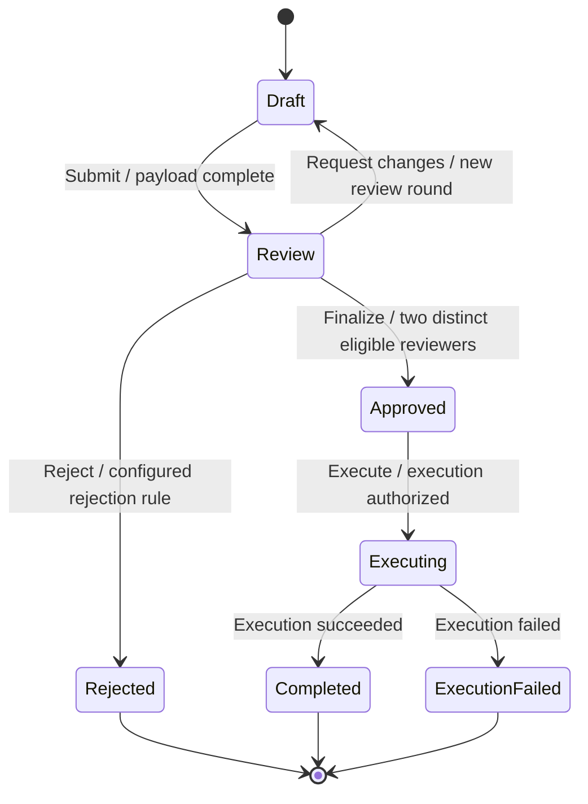

# RFC 0021.b: Multi-person approval and workflow runtime

> **Status: substantially implemented, 2026-09-18** (corrected from a
> stale "proposed, not implemented" header). `crates/nirdosha-workflow/`
> is a real, tested (7 passing tests) reference runtime: four/six-eyes
> quorum via real bipartite matching, maker exclusion, the append-only
> decision ledger, the guarded 5-step transition protocol, the outbox
> (pending/in-flight/succeeded/failed/outcome-unknown, dependency
> ordering, expired-lease handling, explicit reconciliation), and
> live-instance migration (drain-before-migrate, failed migration
> leaves the prior version intact) all match this RFC closely. Closed
> 2026-09-18: the runtime is now reachable at all (`nirdosha-hi workflow
> ...`, a real CLI subcommand family driving the exact library API —
> previously it had zero callers outside its own crate, a real gap
> since nothing else in this RFC specifies its own transport); the
> capability manifest reports the parameterized
> `distinct_person(authority_id, contract_version, freshness_policy)`
> form this RFC's own "Person-equivalence trust contract" section
> requires, with real values, not a bare literal; the mapping assertion
> schema gained `mapping_schema_version`, `authority_key_id`, `audience`
> and `integrity_proof` (all now checked in `install_mapping`,
> including `Authority.audience` itself, which existed but was never
> actually validated against anything before this); and "a split does
> not clone a historical decision into multiple approvals" is now a
> real, passing test
> (`crates/nirdosha-workflow/tests/runtime.rs::split_does_not_clone_a_decision_into_multiple_approvals`),
> confirming — not newly fixing — a property that already held by
> construction (`quorum()` always resolves a decision's person fresh
> from the *current* identity mapping, never a cached historical value).
> Still open, self-disclosed in `Runtime::capabilities()`'s own
> `unsupported` list: delegation, role vetoes, mandatory slots beyond
> quorum, automatic finalization, and `update_plan_id`'s transactional
> update-plan adapter. Depends on
> [workflow authoring schemas](0021.a-workflow-authoring-graph.md) and a durable application-runtime
> implementation. This is independent delivery work, not a phase of
> the [core graph service](0021-typed-hi-graph-mcp-and-incremental-authoring.md).
> Application source and adapters target v2 `.nir` only.

## Motivation

Typed workflow definitions cannot enforce approvals on their own.
Enforcement needs authenticated people, a durable decision ledger,
concurrency control and explicit treatment of external effects.

## Non-goals

Hi does not become a production workflow host. No claim of exactly-once
external effects, automatic discovery of real-person identity, or general
business-process liveness proof. The project MCP proposal API cannot
record human approvals on behalf of the generated application.

## Design

### Four eyes, six eyes, and 2n eyes

Store a distinct-person policy rather than just an `eyes` integer.
Terminology varies, so the UI must display the actual counting rule.
For the examples here, the maker counts as one participant:

| Display name | Distinct participants | Required decisions |
|---|---|---|
| Four eyes | Maker + one different reviewer | One valid approval |
| Six eyes | Maker + two different reviewers | Two valid approvals |
| 2n eyes | Maker + n−1 different reviewers, n ≥ 2 | n−1 valid approvals |

Policies can instead exclude the maker from the displayed count, but
must store/display that choice explicitly. Count verified person
identities, not accounts, sessions, devices, roles, or button clicks.
A trusted identity authority must supply the person-equivalence contract
below where users can have multiple accounts. If it cannot, a policy may
explicitly select the weaker distinct-subject guarantee; do not claim
distinct-person enforcement or silently downgrade a person-based policy.

### Person-equivalence trust contract

The application operator designates an identity authority (for example,
an organization's administered directory with account-to-person records).
That authority, not the LLM or the graph service, owns enrolling people,
linking accounts, merging/splitting identities and revoking assertions.
Federated subject identity is the tuple `(issuer, tenant, subject_id)`;
a bare subject string is insufficient across issuers or tenants.

Runtime integration accepts an authenticated mapping assertion with:

```text
mapping_schema_version
authority_id, authority_key_id, tenant_id
issuer, subject_id
canonical_person_id
mapping_revision, revocation_revision
issued_at, expires_at
audience = application/runtime identity
integrity_proof = signature or equivalent authenticated local-store binding
```

Within the configured trust domain, the authority guarantees that all
enrolled accounts of the same person resolve to one canonical person ID,
and different people are not assigned the same ID. IDs are opaque and
stable across role/session changes. The runtime checks issuer/audience,
tenant, integrity, revision, expiry and configured authority allowlists.
Configuration binds trusted keys and permitted issuers; an assertion
cannot make its own issuer trusted. Role/claim eligibility is separately
authenticated and versioned, never inferred from the person ID itself.

Strict distinct-person capability requires a runtime adapter that can
produce an immutable identity/eligibility snapshot plus a bounded,
operator-configured freshness policy. Fetch/synchronize assertions and
revocation state before opening the application transaction; inside it,
check the local snapshot generation/expiry and reject changed or stale
inputs. Do not hold database locks while waiting for an identity server.
Revocations received before finalization invalidate affected decisions;
instant detection of revocations not yet delivered by a remote authority
is not claimed. Evidence records the authority/mapping/revocation
versions, freshness policy and snapshot actually used.

If a merge makes two reviewers the same person, recompute quorum and
refuse finalization when distinctness is lost. A split does not clone a
historical decision into multiple approvals. Revoked, expired, unknown,
or inconsistent mappings block person-based finalization until refreshed
or explicitly reworked under a new authorized policy/round. A mapping
service outage cannot trigger automatic subject-only fallback.

Threat boundary: a dishonest/misconfigured authority can map one person
to three identities and defeat a six-eye policy. The runtime cannot
discover physical-person equality from account strings; its claim is
conditional on the named authority's mapping guarantees. Shared accounts,
credential theft and collusion are separate residual risks, not solved
by distinctness counting. Administrative mapping changes require their
own authenticated audit trail and are never writable through project MCP,
agent patches or application approval requests. Model-supplied person IDs
are untrusted input and cannot override a verified mapping.

The runtime capability manifest therefore distinguishes
`distinct_subject` from `distinct_person(authority_id, contract_version,
freshness_policy)`. A subject-only deployment displays, for example,
"three distinct authenticated subjects; person independence unverified".
It must not advertise enforced six-eye distinct-person approval.
[0021.a](0021.a-workflow-authoring-graph.md) and core emission gate on
this distinction before claiming enforcement in a generated v2 app.

### Approval policy fields

An `ApprovalPolicy` specifies:

- Quorum, maker-count convention, and mandatory exclusion of the maker
  from reviewer slots for these multi-person approval profiles.
- Eligible roles/claims and distinct slots, such as one operations
  reviewer and one compliance reviewer. A person with both roles cannot
  fill both slots when distinctness is required.
- Sequential stages, parallel collection, or a combination; each stage
  has its quorum. Cross-stage distinctness is explicit and required for
  a whole-workflow 2n-person claim. Reusing reviewers must not inflate
  that claim.
- Optional k-of-m groups, mandatory slots and role-specific vetoes;
  define whether any rejection rejects, requests rework, or waits for
  other decisions. These are policy choices, not LLM guesses.
- Decision lifetime, delegation policy, and eligibility recheck rules.
  Default: validate eligibility when recording a decision and again
  when advancing. Delegation cannot defeat maker separation or count
  a delegate as multiple people.
- Exact approval scope: instance, review-round ID, workflow/policy
  versions, and reviewed payload hash. Any edit to the reviewed payload
  starts a new round and invalidates its previous approvals by default.
- Withdrawal, expiry, rejection, cancellation and resubmission behavior.
  Keep prior decisions in the audit history rather than deleting them.

An append-only runtime decision record contains the instance/round,
policy revision, stage/slot, actor subject and canonical person IDs,
decision, reviewed payload hash, time, authenticated provenance and
idempotency key. The runtime derives validity and quorum from these
records. The LLM cannot submit a forged human decision through
`graph_apply`, just as it cannot forge build evidence.

Definitions belong in the authoring graph. Live workflow instances,
approval decisions and execution audit records belong in the generated
application's durable runtime store. Runtime observations may be linked
back through separately authorized, read-only evidence references;
project MCP is not an approval endpoint for production transactions.

### Example: six-eye payment approval



The `Review` state binds `on_entry` to creating reviewer tasks and
notification intents, and `on_exit` to closing those tasks. Its
`Finalize` transition requires two valid approvals from different
people, neither the maker, covering the same current payload and round.
Recording a decision updates the ledger; it need not leave/re-enter
`Review` or rerun its hooks. The last decision and an automatic finalize,
if configured, are one atomic operation. An explicit finalize event
instead rechecks the same quorum under the transaction lock.

Execution is a distinct state because an external payment is not made
atomic by drawing an edge. Entry into `Approved` records approval;
execution failure remains represented without pretending it undoes
either the historical approval or a possibly completed external action.

### Guard and hook execution contract

A runtime implementation must define and test the following protocol
before the emitter advertises guarded approval workflows as supported:

1. Deduplicate the incoming event and load the instance, round and
   pinned definition/policy revisions under a transaction with an
   expected instance revision. Authorize the actor and recheck decision
   validity/quorum. Repeated events cannot advance twice.
2. Check source invariants, exit conditions and transition guards on
   this consistent context. Reject failure without publishing a state
   change or running external effects.
3. Execute supported local transactional `on_exit` actions and the
   transition update plan against staged data; evaluate the target's
   entry conditions on that prospective data, then run its local
   transactional `on_entry` actions. Validate the target invariant.
   Any failure aborts all local changes. An entry condition that must
   remain true afterward must also be a state invariant.
4. Atomically commit the new state/data/revision, decision consumption,
   audit records and external-action outbox intents. State invariants
   also gate other data updates while the instance remains in a state.
5. Dispatch outbox actions after commit with per-action idempotency
   keys, ordered dependencies where requested, retries and explicit
   failure/compensation handling. External success must never be
   implied by committing an outbox intent. No general exactly-once
   external-effect guarantee is claimed.

Functions that perform external effects cannot masquerade as rollbackable
local hooks. When the target's entry conditions depend on an external
result, use an intermediate state and a result event. Distinguish
timeouts from rejection and from unknown external outcomes. Workflow
definition updates do not silently change running instances: each
instance pins a version and needs an explicit migration plan, including
what happens to approvals and in-flight actions.

### Runtime store and required adapter boundary

The runtime owns separate durable tables for instances (including current
revision/definition/round), immutable decision events, event-idempotency
receipts, outbox intents/delivery attempts and execution audit records.
The initial reference design requires a transactional store supporting
unique constraints and atomic updates across these records. A transition
uses compare-and-swap on instance revision; an instance/round/actor/slot
decision uniqueness rule prevents duplicate approvals. Decision withdrawal
is another event, not deletion. Distinctness/quorum is recomputed inside
the transaction from effective events and the verified identity snapshot.

Each event idempotency key is bound to instance, authenticated actor,
event type and reviewed payload hash. Reusing it with different input
fails; a lost acknowledgment returns its original committed result.
Use the core's normative hashing recipe, with versioned runtime-specific
domains for review payloads/definitions/events. Do not hash only a UI
summary while approving different underlying transaction data.

An adapter must implement the guarded transition protocol above, local
transactional hook execution, authenticated actor context, versioned
identity snapshot validation and outbox handling. A generated call to
the current pure `workflow!` transition function is insufficient.
One reference durable runtime and a v2 lowering adapter must pass the
acceptance suite before the capability is advertised. Storage-vendor
adapters require the same conformance suite; this proposal does not
select a production database on the user's behalf.

### External effects and live-instance upgrades

Outbox records use stable per-instance/event/action identities and record
pending, in-flight, succeeded, failed and outcome-unknown states. A worker
may deliver an action more than once after a crash. Use provider-supported
idempotency where available; otherwise reconciliation is required before
retrying an effect whose result is unknown. Never declare success merely
because the worker sent a request. Action dependencies enforce ordering
within the documented plan; independent actions may be processed in
parallel. Compensation is explicit and can itself fail.

Running instances pin their definition, approval policy and reviewed
payload versions. An administrator-authorized migration maps old states,
data and pending actions to a new version and records its input/output
revisions. By default any changed approval meaning/payload starts a new
review round. Retaining decisions needs a supported equivalence check
and explicit migration policy; an LLM's assertion of equivalence is
insufficient. In-flight external effects must be drained, reconciled or
explicitly carried over before migration commits. A failed migration
leaves the prior instance version intact. No auto-upgrade on graph edits.

## Effect on the permission model

The runtime authenticates decision actors using application credentials;
project `graph.propose`/`graph.accept` do not authorize approval actions.
Separate operator grants control identity authority configuration,
definition deployment and live-instance migration. Role/claim checks,
maker separation and person counting are enforced by the runtime, not
UI button visibility. Agents cannot fabricate decisions, person mappings,
capability attestations or delivery evidence through the graph tools.

## Compatibility

Adds optional runtime support for v2 applications. Existing state-shape
macros retain their documented scope until a new adapter is selected.
0021.a definitions can be stored without this runtime, but code emission
must block if the requested behavior demands absent enforcement.
Importing an old authoring graph does not import production approval
decisions or establish person identity. No v1 `.nir` compatibility path.

## Acceptance criteria

| Stage | Deliverable | Evidence |
|---|---|---|
| B1 | Runtime contract, store and capability manifest | Validated instance/definition schema, transaction adapter and v2 integration; incapable target refuses emission |
| B2 | Identity/eligibility adapter | Multi-account same-person rejection; cross-issuer subject scoping; wrong issuer/audience, stale/expired/revoked mappings; merge/split/outage behavior; agent cannot write mappings |
| B3 | Durable decisions and quorum | Maker excluded; same person with multiple roles cannot fill distinct slots; four/six/2n eyes, sequential/parallel/k-of-m, rejection/veto/rework; duplicate/concurrent final approval and lost-ack replay |
| B4 | Guarded execution and hooks | Exit/entry/invariant failures roll back local writes; typed hook invocation and effect classification; stale identity/data snapshot rejection; cancellation not accidentally approval-gated |
| B5 | Outbox/recovery | Crash before/after commit and before/after provider success; no duplicate state advance; provider idempotency or explicit outcome-unknown reconciliation; compensation failure visible |
| B6 | Live-instance migration and audit | Pinned definitions, changed-payload invalidation, safe handling of in-flight actions, failed migration rollback and evidence retention |

End-to-end fixture: maker submits a versioned request; one reviewer with
two accounts/roles cannot satisfy both six-eye slots. A second genuine
reviewer completes quorum. Race two finalizations and observe one state
advance/outbox intent. Crash the dispatcher after an external success
but before local acknowledgment, then verify documented retry or unknown-
outcome handling. Edit the payload and demonstrate that previous-round
decisions cannot authorize the changed request.

These acceptance criteria require runtime, compiler adapter and identity
integration evidence. Passing core graph tests or storing the policy
does not count as completion of this RFC.

## Open questions

Select the first durable-store adapter and identity authority integration
when implementing B1/B2. Both are required delivery decisions before any
runtime capability claim; the invariant/conformance contract above is
fixed independently of vendor selection.

## Rejected alternatives

- Count accounts or roles as people: permits one actor to satisfy an
  ostensibly independent multi-person approval.
- Ask the LLM to attest identity or runtime enforcement: no trusted
  identity or execution evidence supports that claim.
- Run external effects inside a presumed rollbackable transition:
  a local rollback cannot undo an already delivered external request.
- Reuse approvals across arbitrary payload/definition changes: changes
  what people approved without another decision.

## References

- [Core graph service](0021-typed-hi-graph-mcp-and-incremental-authoring.md).
- [Workflow authoring data](0021.a-workflow-authoring-graph.md).
- [Evidence and checker integration](0021.c-graph-analysis.md).
