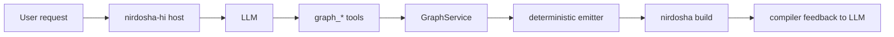
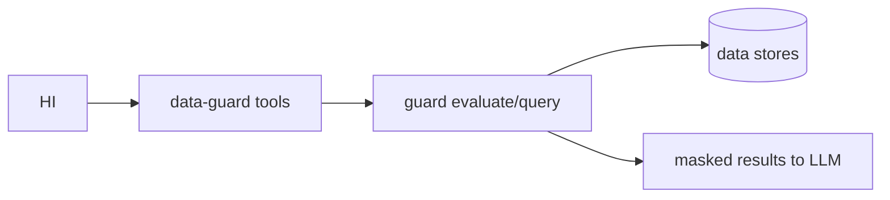

# RFC 0024: `nirdosha-hi` and `nirdosha-guard-mcp` integration

> **Status:** proposed, awaiting review  
> **Targets:** v2 Rust dialect (`nirdosha-rt` / `cargo-nirdosha` / `nirdosha-guard-mcp`) — the deprecated native `.nir` compiler (`crates/compiler`) is not modified by this RFC.  
> **Depends on:** [RFC 0021](0021-typed-hi-graph-mcp-and-incremental-authoring.md) (project graph MCP), [RFC 0023](0023-data-guard.md) (data-guard MCP)  
> **Scope:** how the agentic console hosts an LLM session that uses both MCP surfaces, and the controls that prevent the agent from becoming a policy bypass.

## Motivation

`nirdosha hi` (RFC 0012) is the project's native LLM console. RFC 0021 gives it a project-bound graph MCP: the agent can read and mutate a typed graph of modules, structs, functions, screens, contracts, and policies. RFC 0023 adds a *second* MCP surface, `nirdosha-guard-mcp`, through which an agent can query and write live data under the same policies that govern compiled programs.

The two surfaces together create a powerful but dangerous loop:

1. The agent mutates the graph (RFC 0021).
2. Those mutations can change `policy!` blocks, `#[dataset]` bindings, and `#[classify]` annotations.
3. The same agent can then call `nirdosha-guard-mcp` data tools that are evaluated against the *new* graph-derived registry.

Without explicit controls, the agent can write a policy that grants itself more data access and then immediately exploit that grant. This RFC documents how the flows compose and the hard mitigations that keep the composition safe.

## Design

### 1. The two MCP surfaces are separate principals

| Surface | Owned by | What it exposes | Trust boundary |
|---|---|---|---|
| **Project graph MCP** (RFC 0021) | `nirdosha-hi` host | `graph_get_node`, `graph_apply`, `graph_accept`, `graph_validate` | The host trusts the *user* who authorized the session; the model is a delegate. |
| **Data-guard MCP** (RFC 0023 §1C.3) | `nirdosha-guard-mcp` | `list_entities`, `describe_entity`, `get_options`, `query_records`, `evaluate`, `submit_write` | The guard trusts a **delegation token** issued by the host, scoped to a user + purpose + agent identity. |

`nirdosha-hi` is a client of both. The LLM sees the union of tools, but the underlying services enforce different authorization models. The host must never forward its own authority to the model.

### 2. Session establishment: identity, purpose, and delegation token

Before any data tool is advertised to the model, `nirdosha-hi` performs the following setup:

```rust
// Pseudocode for the host-side session bootstrap
let user_identity: VerifiedIdentity = authenticate_user()?;
let agent_identity: AgentIdentity = authenticate_agent()?;   // the hi console / model instance
let purpose: Purpose = Purpose::Operations;                  // or Support, Agent, etc.
let destination: Destination = Destination::LlmContext;

let delegation: DelegationToken = guard_mint_delegation(
    user_identity,
    agent_identity,
    purpose,
    destination,
    ttl = session_max,
)?;
```

Rules:

- The token is **non-transferable** (audience-restricted, session-scoped). Presenting it from a different process or user fails.
- Effective scope is the **intersection** of user scopes, agent grants, and declared purpose.
- The token is bound to `destination = llm-context`, which triggers RFC 0023's stricter default posture.
- The token is **never exposed to the model**. It is held by the host MCP dispatcher and attached to outbound data-guard tool calls.

### 3. What the model sees

The host advertises tools from both MCP servers with stable, signed descriptions:

```text
# From project graph MCP
graph_get_node
graph_apply
graph_accept
graph_validate
...

# From data-guard MCP
list_entities
describe_entity
get_options
query_records
evaluate
submit_write   # only if policy permits agent writes for this session
```

`submit_write` is **default-off**. The host queries the guard at session start to decide whether to advertise it. If the user purpose does not grant agent writes, the tool is omitted entirely rather than returning denials later.

### 4. Flow composition

A typical `nirdosha-hi` session now has two interleaved loops:

#### Loop A — authoring (existing RFC 0021 flow)



#### Loop B — data-aware reasoning (new RFC 0023 flow)



Both loops run through the same LLM session, but each tool call is routed to the correct server and authorized independently.

### 5. The agent cannot silently broaden its own access

This is the core mitigation. Three mechanisms enforce it:

#### 5.1 Policy mutations are guarded mutations with maker-checker

RFC 0023 §2 treats policy changes as `action = "migrate"` or `action = "update"` on the policy registry entity. They require:

- dry-run before apply,
- approval above a configured severity threshold,
- full audit.

In `nirdosha-hi`, a `graph_apply` patch that adds or modifies a `Policy` node does not immediately change the guard's effective policy. It creates a **proposed policy revision**. Promotion to accepted requires an explicit `graph_accept` call with a promotion grant.

The LLM may propose the policy, but it cannot accept it unilaterally.

#### 5.2 The delegation token's scope is fixed at mint time

Even if a new policy is accepted during the session, the delegation token issued at session start does **not** automatically expand. It carries a `policy_version` and `scope_hash`. To benefit from a newly accepted policy, the agent would need:

- a fresh token,
- a new `nirdosha-hi` session,
- and the new policy must actually grant the broader access.

This prevents the "propose + exploit in the same turn" attack.

#### 5.3 Agent writes require evaluate-then-act with hash matching

RFC 0023 §1C.3:

> A write requires a prior `evaluate` in the same delegation session whose plan hash matches the submitted plan exactly.

The host MCP dispatcher enforces this mechanically:

1. `evaluate` returns a `WritePlan` and a `plan_hash`.
2. The host stores the pair in the session journal.
3. `submit_write` must reference the same `plan_hash`.
4. The guard recomputes the plan and rejects any mismatch.

The LLM cannot substitute a broader plan after seeing the evaluation result.

### 6. Tool descriptions are signed build-time artifacts

RFC 0023 §1C.3:

> Tool descriptions are static, build-time artifacts, reviewed and signed with the policy bundle — never derived from user-controlled or runtime data.

`nirdosha-hi` must:

- Load descriptions from the guard registry, not synthesize them.
- Verify the signature (`verify-artifact`) before advertising the tool.
- Reject any tool whose description was generated outside the signed build.

This prevents a compromised registry from injecting malicious tool definitions into the LLM context.

### 7. Audit and accountability

Every action in an agent session is recorded in two separate audit streams:

| Stream | Events | Owner |
|---|---|---|
| **Graph audit** | `graph_apply`, `graph_accept`, patch hashes, actor | `GraphService` |
| **Guard audit** | `query_records`, `evaluate`, `submit_write`, delegation token, plan hashes, denials | `nirdosha-guard-core` |

A security review can correlate them: if an agent proposed a policy change and then attempted a write, both events appear and can be traced to the same session, user, and agent identity.

### 8. Destination control and prompt-injection containment

- All data-guard calls from `nirdosha-hi` set `destination = llm-context`.
- Default policy denies `llm-context` for classification ≥ `CONFIDENTIAL` and sensitive-purpose reads unless explicitly granted.
- Masked fields are **absent** from tool results, not replaced with placeholders. The model cannot see what it may not see.
- Tool results are tagged data, not natural-language instructions. The host never injects policy internals, other subjects' traces, or credentials into the model context.

### 9. Session lifecycle and revocation

- Delegation tokens have a TTL (default: session-bound, max 1 hour).
- The host revokes the token on session end, user logout, or policy change.
- The guard's bulk-revocation path (RFC 0023 §12) cancels in-flight queries.
- If the guard is down, data tools fail closed (RFC 0023 I5); graph tools may still operate on the local graph.

## Effect on the permission model

This RFC adds a new host-level trust boundary but does not change the compiled `.nir` program's permission model (`requires(role/claim: ...)`, `acquire`, screen gates, or `serve.rs` enforcement).

It does add a **runtime policy dimension**: the agent is itself a subject. A generated program and the LLM that generated it may have different access scopes. This is intentional and safe.

## Compatibility

Purely additive. Existing `nirdosha hi` behavior is unchanged when no guard MCP is configured. A project without `#[dataset]` / `policy!` blocks simply exposes no data-guard tools to the model.

The graph MCP surface is unchanged. The data-guard MCP is a new optional client.

## Rejected alternatives

### A. Single combined MCP server

Merging graph tools and guard tools into one server would obscure the separate authorization models and make it easier for a compromised component to impersonate the other. Keeping them separate preserves the principal boundary.

### B. Agent mints its own delegation token

Allowing the LLM or its host to mint a broad token defeats the purpose of RFC 0023's non-transferable, user-bound delegation. The human user's identity must be in the minting chain.

### C. Policy changes accepted automatically during an agent session

Auto-promotion would let the model broaden its access and immediately exploit it. Maker-checker and explicit `graph_accept` are kept.

### D. Tool descriptions generated at runtime from the live database

Runtime-generated descriptions can be poisoned by compromised data. Signed build-time artifacts are kept.

## Open questions

1. Should `nirdosha-hi` expose a single combined tool list or namespace the two MCP servers visually to the model (e.g., `graph_` and `data_` prefixes)? The prefixes are recommended here but not mandated.
2. What is the default `Purpose` for an ad-hoc `nirdosha hi` chat session — `Operations`, `Agent`, or `Support`? This affects default caps and destination control.
3. Should agent write access require an explicit user confirmation in the TUI before `submit_write`, even when the guard policy allows it? This is a UX/security trade-off.
4. How does a user initiate a data-aware `nirdosha hi` session in a project that has not yet declared any `#[dataset]` bindings? The guard MCP simply advertises no data tools; the session degrades to the existing graph-authoring flow.
